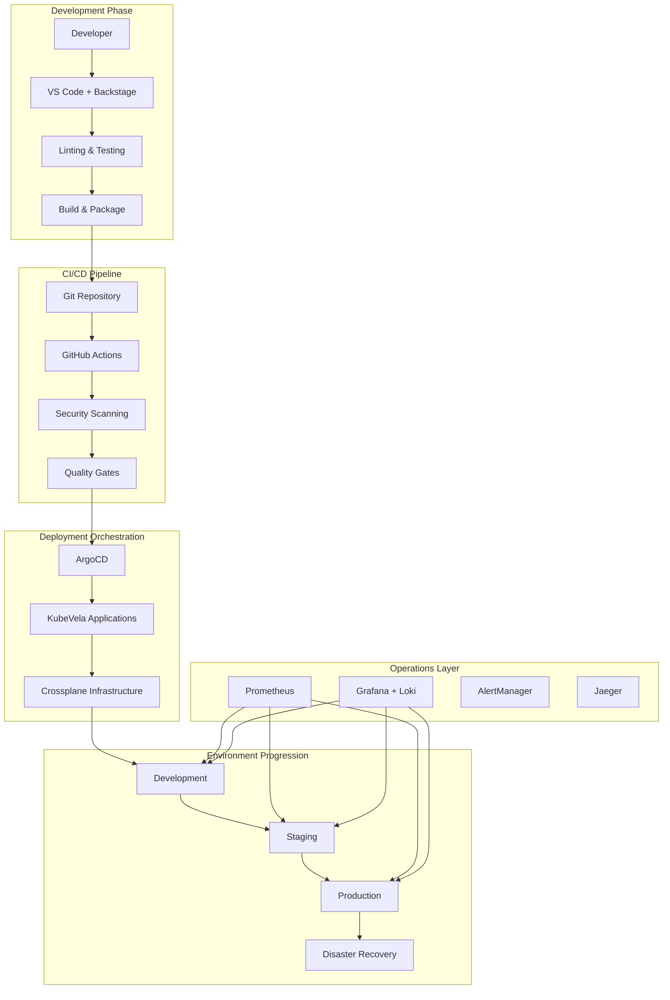

# Advanced Application Lifecycles

This comprehensive example demonstrates the complete advanced application lifecycle management with sophisticated deployment patterns, comprehensive automation, and production-grade operations across multiple environments and cloud providers.

## What This Example Shows

- Complete application lifecycle from development to production
- Advanced deployment patterns (Blue-Green, Canary, Progressive)
- Multi-environment promotion workflows
- Automated testing and quality gates
- Production-grade monitoring and observability
- Disaster recovery and business continuity
- Comprehensive security and compliance automation

## Application Lifecycle Architecture



## Prerequisites

- IDP Stack with all components installed
- GitHub Actions or equivalent CI/CD
- Multi-environment Kubernetes clusters
- Monitoring stack (Prometheus, Grafana, Jaeger)
- Security scanning tools integrated

## Quick Start

```bash
# 1. Navigate to this example
cd examples/advanced/application-lifecycles

# 2. Configure environments
cp .env.example .env
# Edit .env with your configuration

# 3. Run the complete lifecycle demo
./run-lifecycle-demo.sh

# 4. Monitor across environments
./monitor-deployments.sh
```

## Comprehensive Example Structure

```
application-lifecycles/
├── README.md                           # This file
├── .env.example                        # Environment template
├── run-lifecycle-demo.sh              # Complete lifecycle automation
├── monitor-deployments.sh             # Cross-environment monitoring
├── applications/                       # Sample applications
│   ├── microservice-go/
│   │   ├── src/
│   │   ├── Dockerfile
│   │   ├── helm/
│   │   ├── .github/workflows/
│   │   └── tests/
│   ├── frontend-react/
│   │   ├── src/
│   │   ├── Dockerfile
│   │   ├── helm/
│   │   └── tests/
│   └── data-pipeline-python/
│       ├── src/
│       ├── Dockerfile
│       ├── helm/
│       └── tests/
├── kubevela/                          # KubeVela applications
│   ├── development/
│   │   ├── microservice-dev.yaml
│   │   ├── frontend-dev.yaml
│   │   └── pipeline-dev.yaml
│   ├── staging/
│   │   ├── microservice-staging.yaml
│   │   ├── frontend-staging.yaml
│   │   └── pipeline-staging.yaml
│   └── production/
│       ├── microservice-prod.yaml
│       ├── frontend-prod.yaml
│       └── pipeline-prod.yaml
├── deployments/                       # Advanced deployment patterns
│   ├── blue-green/
│   │   ├── blue-green-trait.yaml
│   │   ├── blue-green-workflow.yaml
│   │   └── traffic-split.yaml
│   ├── canary/
│   │   ├── canary-trait.yaml
│   │   ├── canary-workflow.yaml
│   │   └── analysis-template.yaml
│   └── progressive/
│       ├── progressive-trait.yaml
│       ├── progressive-workflow.yaml
│       └── rollback-strategy.yaml
├── infrastructure/                    # Environment-specific infrastructure
│   ├── development/
│   ├── staging/
│   └── production/
├── monitoring/                        # Comprehensive observability
│   ├── prometheus/
│   │   ├── application-rules.yaml
│   │   ├── sli-slo-definitions.yaml
│   │   └── recording-rules.yaml
│   ├── grafana/
│   │   ├── application-dashboard.json
│   │   ├── deployment-dashboard.json
│   │   └── business-metrics.json
│   ├── jaeger/
│   │   ├── tracing-config.yaml
│   │   └── sampling-strategies.yaml
│   └── alerting/
│       ├── application-alerts.yaml
│       ├── deployment-alerts.yaml
│       └── business-alerts.yaml
├── security/                         # Security and compliance
│   ├── policies/
│   │   ├── network-policies.yaml
│   │   ├── pod-security-standards.yaml
│   │   └── rbac-policies.yaml
│   ├── scanning/
│   │   ├── trivy-config.yaml
│   │   ├── falco-rules.yaml
│   │   └── opa-policies.yaml
│   └── compliance/
│       ├── cis-benchmarks.yaml
│       ├── pci-requirements.yaml
│       └── gdpr-controls.yaml
├── testing/                          # Comprehensive testing strategy  
│   ├── unit/
│   ├── integration/
│   ├── performance/
│   ├── security/
│   └── chaos/
├── workflows/                        # CI/CD and automation
│   ├── github-actions/
│   │   ├── build-test-deploy.yml
│   │   ├── security-scan.yml
│   │   └── promotion-workflow.yml
│   ├── argocd/
│   │   ├── applications/
│   │   ├── projects/
│   │   └── repositories/
│   └── scripts/
│       ├── promote-environment.sh
│       ├── rollback-deployment.sh
│       └── validate-deployment.sh
└── docs/                             # Comprehensive documentation
    ├── deployment-patterns.md
    ├── environment-strategy.md
    ├── monitoring-runbooks.md
    ├── security-guidelines.md
    └── troubleshooting.md
```

## 🎨 Advanced KubeVela Application Configurations

### Production Microservice with Advanced Traits

```yaml
# kubevela/production/microservice-prod.yaml
apiVersion: core.oam.dev/v1beta1
kind: Application
metadata:
  name: payment-service
  namespace: production
  annotations:
    version: v2.1.0
    deployment.pattern: blue-green
    monitoring.enabled: "true"
    security.scan: "passed"
spec:
  components:
    - name: payment-api
      type: webservice
      properties:
        image: ghcr.io/company/payment-service:v2.1.0
        ports:
          - port: 8080
            expose: true
        env:
          - name: DATABASE_URL
            valueFrom:
              secretKeyRef:
                name: payment-db-connection
                key: url
          - name: REDIS_URL
            valueFrom:
              secretKeyRef:
                name: payment-cache-connection
                key: url
          - name: METRICS_ENABLED
            value: "true"
          - name: TRACING_ENABLED
            value: "true"
        resources:
          requests:
            cpu: 500m
            memory: 1Gi
          limits:
            cpu: 2000m
            memory: 4Gi
        livenessProbe:
          httpGet:
            path: /health/live
            port: 8080
          initialDelaySeconds: 30
          periodSeconds: 10
          failureThreshold: 3
        readinessProbe:
          httpGet:
            path: /health/ready
            port: 8080
          initialDelaySeconds: 5
          periodSeconds: 5
          failureThreshold: 3
      
      traits:
        # Advanced Blue-Green Deployment
        - type: blue-green-deployment
          properties:
            enabled: true
            autoPromote: false
            scaleDownDelaySeconds: 300
            prePromotionAnalysis:
              templates:
                - templateName: success-rate
                - templateName: avg-response-time
                - templateName: error-budget
              args:
                - name: service-name
                  value: payment-service
            postPromotionAnalysis:
              templates:
                - templateName: success-rate
                - templateName: avg-response-time
              args:
                - name: service-name
                  value: payment-service
        
        # Advanced Horizontal Pod Autoscaling
        - type: hpa-advanced
          properties:
            minReplicas: 3
            maxReplicas: 50
            targetCPUUtilizationPercentage: 70
            targetMemoryUtilizationPercentage: 80
            behavior:
              scaleUp:
                stabilizationWindowSeconds: 60
                policies:
                  - type: Percent
                    value: 100
                    periodSeconds: 15
                  - type: Pods
                    value: 4
                    periodSeconds: 60
                selectPolicy: Max
              scaleDown:
                stabilizationWindowSeconds: 300
                policies:
                  - type: Percent
                    value: 10
                    periodSeconds: 60
                selectPolicy: Min
            metrics:
              - type: Resource
                resource:
                  name: cpu
                  target:
                    type: Utilization
                    averageUtilization: 70
              - type: Resource
                resource:
                  name: memory
                  target:
                    type: Utilization
                    averageUtilization: 80
              - type: Pods
                pods:
                  metric:
                    name: http_requests_per_second
                  target:
                    type: AverageValue
                    averageValue: "100"
        
        # Advanced Service Mesh Configuration
        - type: istio-service-mesh
          properties:
            enabled: true
            trafficPolicy:
              tls:
                mode: ISTIO_MUTUAL
              connectionPool:
                tcp:
                  maxConnections: 100
                  connectTimeout: 30s
                  keepAlive:
                    time: 7200s
                    interval: 75s
                http:
                  http1MaxPendingRequests: 100
                  http2MaxRequests: 1000
                  maxRequestsPerConnection: 10
                  maxRetries: 3
                  idleTimeout: 90s
                  h2UpgradePolicy: UPGRADE
              circuitBreaker:
                consecutiveGatewayErrors: 5
                consecutiveServerErrors: 5
                interval: 30s
                baseEjectionTime: 30s
                maxEjectionPercent: 50
                minHealthPercent: 30
              outlierDetection:
                consecutiveGatewayErrors: 5
                interval: 30s
                baseEjectionTime: 30s
                maxEjectionPercent: 50
                minHealthPercent: 30
            retryPolicy:
              attempts: 3
              perTryTimeout: 2s
              retryOn: 5xx,reset,connect-failure,refused-stream
              retryRemoteLocalities: true
        
        # Advanced Security Policies
        - type: security-advanced
          properties:
            podSecurityContext:
              runAsNonRoot: true
              runAsUser: 65534
              fsGroup: 65534
              seccompProfile:
                type: RuntimeDefault
            containerSecurityContext:
              allowPrivilegeEscalation: false
              runAsNonRoot: true
              runAsUser: 65534
              capabilities:
                drop: ["ALL"]
                add: ["NET_BIND_SERVICE"]
              readOnlyRootFilesystem: true
              seccompProfile:
                type: RuntimeDefault
            networkPolicy:
              policyTypes: ["Ingress", "Egress"]
              ingress:
                - from:
                    - namespaceSelector:
                        matchLabels:
                          name: frontend
                    - namespaceSelector:
                        matchLabels:
                          name: api-gateway
                  ports:
                    - protocol: TCP
                      port: 8080
              egress:
                - to:
                    - namespaceSelector:
                        matchLabels:
                          name: database
                  ports:
                    - protocol: TCP
                      port: 5432
                - to:
                    - namespaceSelector:
                        matchLabels:
                          name: cache
                  ports:
                    - protocol: TCP
                      port: 6379
                - to: []
                  ports:
                    - protocol: TCP
                      port: 53
                    - protocol: UDP
                      port: 53
        
        # Comprehensive Monitoring and Observability
        - type: monitoring-advanced
          properties:
            metrics:
              enabled: true
              port: 9090
              path: /metrics
              scrapeInterval: 15s
              labels:
                app: payment-service
                version: v2.1.0
                environment: production
            logging:
              enabled: true
              level: info
              format: json
              outputs:
                - type: stdout
                - type: loki
                  endpoint: http://loki.monitoring.svc.cluster.local:3100
            tracing:
              enabled: true
              jaeger:
                endpoint: http://jaeger-collector.monitoring.svc.cluster.local:14268
                samplingRate: 0.1
              headers:
                - x-request-id
                - x-b3-traceid
                - x-b3-spanid
            healthChecks:
              liveness:
                enabled: true
                path: /health/live
                port: 8080
                initialDelaySeconds: 30
                periodSeconds: 10
                timeoutSeconds: 5
                failureThreshold: 3
              readiness:
                enabled: true
                path: /health/ready
                port: 8080
                initialDelaySeconds: 5
                periodSeconds: 5
                timeoutSeconds: 3
                failureThreshold: 3
              startup:
                enabled: true
                path: /health/startup
                port: 8080
                initialDelaySeconds: 10
                periodSeconds: 10
                timeoutSeconds: 3
                failureThreshold: 30
  
  # Advanced Workflow for Deployment Orchestration
  workflow:
    steps:
      - name: pre-deployment-checks
        type: suspend
        properties:
          duration: 0
      - name: security-validation
        type: apply-component
        properties:
          component: security-scanner
        timeout: 300s
      - name: infrastructure-readiness
        type: apply-component
        properties:
          component: infrastructure-validator  
        timeout: 180s
      - name: database-migration
        type: apply-component
        properties:
          component: db-migrator
        timeout: 600s
      - name: deploy-blue
        type: apply-component
        properties:
          component: payment-api
          revision: blue
        timeout: 300s
      - name: smoke-tests
        type: apply-component
        properties:
          component: smoke-test-runner
        timeout: 120s
      - name: performance-validation
        type: suspend
        properties:
          duration: 300s
      - name: promote-to-green
        if: inputs.autoPromote == "true"
        type: apply-component
        properties:
          component: traffic-shifter
          revision: green
        timeout: 300s
      - name: cleanup-blue
        type: apply-component
        properties:
          component: blue-cleanup
        timeout: 60s

  policies:
    # Advanced Environment-Specific Policies
    - name: production-topology
      type: topology
      properties:
        namespace: production
        clusters: ["prod-us-east-1", "prod-ap-southeast-1", "prod-eu-west-1"]
        placement:
          clusterSelector:
            region: us-east-1
          namespaceSelector:
            environment: production
    
    # Advanced Multi-Cluster Deployment
    - name: multi-cluster-deployment
      type: override
      properties:
        components:
          - name: payment-api
            traits:
              - type: cluster-gateway
                properties:
                  clusters: ["prod-us-east-1", "prod-ap-southeast-1"]
                  loadBalancing:
                    type: round-robin
                  healthCheck:
                    enabled: true
                    interval: 30s
                    timeout: 10s
                    unhealthyThreshold: 3
                    healthyThreshold: 2
    
    # Advanced Security and Compliance Policies  
    - name: security-compliance
      type: security
      properties:
        podSecurityStandards:
          enforce: restricted
          audit: restricted
          warn: restricted
        networkPolicies:
          defaultDeny: true
          allowDNS: true
        serviceAccount:
          automountToken: false
          annotations:
            iam.gke.io/gcp-service-account: payment-service@project.iam.gserviceaccount.com
    
    # Advanced Resource Management
    - name: resource-management
      type: resource-quota
      properties:
        hard:
          requests.cpu: "10"
          requests.memory: 20Gi
          limits.cpu: "40"
          limits.memory: 80Gi
          count/pods: 50
          count/persistentvolumeclaims: 10
```

## Advanced Deployment Patterns

### Blue-Green Deployment with Automated Analysis

```yaml
# deployments/blue-green/blue-green-workflow.yaml
apiVersion: argoproj.io/v1alpha1
kind: Workflow
metadata:
  name: blue-green-deployment
  namespace: production
spec:
  entrypoint: blue-green-deploy
  arguments:
    parameters:
      - name: app-name
        value: payment-service
      - name: new-image
        value: ghcr.io/company/payment-service:v2.1.0
      - name: analysis-duration
        value: 300s
      - name: auto-promote
        value: "false"
  
  templates:
    - name: blue-green-deploy
      dag:
        tasks:
          - name: pre-deployment-validation
            template: validate-prerequisites
          
          - name: deploy-green
            template: deploy-green-version
            dependencies: [pre-deployment-validation]
            
          - name: run-smoke-tests
            template: smoke-tests
            dependencies: [deploy-green]
            
          - name: start-analysis
            template: analysis-run
            dependencies: [run-smoke-tests]
            
          - name: wait-for-analysis
            template: wait-for-analysis-completion  
            dependencies: [start-analysis]
            
          - name: promote-or-rollback
            template: promotion-decision
            dependencies: [wait-for-analysis]
            
          - name: cleanup-blue
            template: cleanup-old-version
            dependencies: [promote-or-rollback]
            when: "{{tasks.promote-or-rollback.outputs.result}} == success"
    
    - name: validate-prerequisites
      script:
        image: curlimages/curl
        command: [sh]
        source: |
          # Validate infrastructure readiness
          curl -f http://payment-db.production.svc.cluster.local:5432/health || exit 1
          curl -f http://payment-cache.production.svc.cluster.local:6379/ping || exit 1
          
          # Validate monitoring stack
          curl -f http://prometheus.monitoring.svc.cluster.local:9090/-/healthy || exit 1
          curl -f http://grafana.monitoring.svc.cluster.local:3000/api/health || exit 1
          
          echo "Prerequisites validation passed"
    
    - name: deploy-green-version
      container:
        image: argoproj/kubectl-argo-rollouts:latest
        command: [sh, -c]
        args:
          - |
            kubectl patch application {{workflow.parameters.app-name}} \
              -n production \
              --type merge \
              -p '{"spec":{"source":{"helm":{"parameters":[{"name":"image.tag","value":"{{workflow.parameters.new-image}}"}]}}}}'
            
            kubectl argo rollouts set image {{workflow.parameters.app-name}} \
              payment-api={{workflow.parameters.new-image}} \
              -n production
            
            kubectl argo rollouts promote {{workflow.parameters.app-name}} \
              --skip-current-step \
              -n production
    
    - name: smoke-tests
      container:
        image: curlimages/curl  
        command: [sh, -c]
        args:
          - |
            # Wait for green version to be ready
            sleep 60
            
            # Basic health check
            curl -f http://{{workflow.parameters.app-name}}-green.production.svc.cluster.local:8080/health || exit 1
            
            # API functionality test
            response=$(curl -s -o /dev/null -w "%{http_code}" http://{{workflow.parameters.app-name}}-green.production.svc.cluster.local:8080/api/v1/status)
            if [ $response -ne 200 ]; then
              echo "API test failed with status $response"
              exit 1
            fi
            
            echo "Smoke tests passed"
    
    - name: analysis-run
      container:
        image: argoproj/kubectl-argo-rollouts:latest
        command: [sh, -c]
        args:
          - |
            kubectl argo rollouts create analysisrun {{workflow.parameters.app-name}}-analysis \
              --from=rollout/{{workflow.parameters.app-name}} \
              -n production
    
    - name: wait-for-analysis-completion
      container:
        image: argoproj/kubectl-argo-rollouts:latest
        command: [sh, -c]
        args:
          - |
            kubectl argo rollouts wait {{workflow.parameters.app-name}} \
              --for=condition=Progressing \
              --timeout={{workflow.parameters.analysis-duration}} \
              -n production
    
    - name: promotion-decision
      script:
        image: argoproj/kubectl-argo-rollouts:latest
        command: [sh]
        source: |
          # Get analysis result
          analysis_result=$(kubectl get analysisrun {{workflow.parameters.app-name}}-analysis \
            -n production \
            -o jsonpath='{.status.phase}')
          
          if [ "$analysis_result" = "Successful" ]; then
            if [ "{{workflow.parameters.auto-promote}}" = "true" ]; then
              kubectl argo rollouts promote {{workflow.parameters.app-name}} -n production
              echo "success"
            else
              echo "Manual approval required for promotion"
              echo "pending"
            fi
          else
            kubectl argo rollouts abort {{workflow.parameters.app-name}} -n production
            echo "failed"
          fi
    
    - name: cleanup-old-version
      container:
        image: argoproj/kubectl-argo-rollouts:latest
        command: [sh, -c]
        args:
          - |
            kubectl argo rollouts promote {{workflow.parameters.app-name}} \
              --skip-all-steps \
              -n production
            
            echo "Blue version cleaned up successfully"
```

### Canary Deployment with Advanced Analysis

```yaml
# deployments/canary/canary-workflow.yaml
apiVersion: argoproj.io/v1alpha1
kind: Rollout
metadata:
  name: payment-service-canary
  namespace: production
spec:
  replicas: 10
  strategy:
    canary:
      canaryService: payment-service-canary
      stableService: payment-service-stable
      analysis:
        templates:
          - templateName: success-rate
          - templateName: avg-response-time
          - templateName: error-budget
        startingStep: 2
        args:
          - name: service-name
            value: payment-service
          - name: canary-hash
            valueFrom:
              podTemplateHashValue: Latest
      steps:
        - setWeight: 5
        - pause:
            duration: 2m
        - setWeight: 10
        - pause:
            duration: 5m
        - analysis:
            templates:
              - templateName: success-rate
              - templateName: avg-response-time
            args:
              - name: service-name
                value: payment-service
        - setWeight: 20
        - pause:
            duration: 10m
        - analysis:
            templates:
              - templateName: success-rate
              - templateName: avg-response-time
              - templateName: error-budget
            args:
              - name: service-name
                value: payment-service
        - setWeight: 40
        - pause:
            duration: 10m
        - setWeight: 60
        - pause:
            duration: 10m
        - setWeight: 80
        - pause:
            duration: 10m
        - setWeight: 100
        - pause:
            duration: 5m
  selector:
    matchLabels:
      app: payment-service
  template:
    metadata:
      labels:
        app: payment-service
    spec:
      containers:
        - name: payment-api
          image: ghcr.io/company/payment-service:v2.1.0
          ports:
            - containerPort: 8080
          resources:
            requests:
              cpu: 500m
              memory: 1Gi
            limits:
              cpu: 2000m
              memory: 4Gi

---
apiVersion: argoproj.io/v1alpha1
kind: AnalysisTemplate
metadata:
  name: success-rate
  namespace: production
spec:
  args:
    - name: service-name
    - name: canary-hash
  metrics:
    - name: success-rate
      successCondition: result[0] >= 0.95
      failureLimit: 3
      interval: 30s
      count: 5
      provider:
        prometheus:
          address: http://prometheus.monitoring.svc.cluster.local:9090
          query: |
            sum(rate(http_requests_total{job="{{args.service-name}}",code!~"5.."}[1m])) /
            sum(rate(http_requests_total{job="{{args.service-name}}"}[1m]))

---
apiVersion: argoproj.io/v1alpha1
kind: AnalysisTemplate
metadata:
  name: avg-response-time
  namespace: production
spec:
  args:
    - name: service-name
  metrics:
    - name: avg-response-time
      successCondition: result[0] <= 500
      failureLimit: 3
      interval: 30s
      count: 5
      provider:
        prometheus:
          address: http://prometheus.monitoring.svc.cluster.local:9090
          query: |
            histogram_quantile(0.95,
              sum(rate(http_request_duration_seconds_bucket{job="{{args.service-name}}"}[1m]))
              by (le)
            ) * 1000

---
apiVersion: argoproj.io/v1alpha1
kind: AnalysisTemplate
metadata:
  name: error-budget
  namespace: production
spec:
  args:
    - name: service-name
  metrics:
    - name: error-budget
      successCondition: result[0] >= 0.001
      interval: 5m
      count: 1
      provider:
        prometheus:
          address: http://prometheus.monitoring.svc.cluster.local:9090
          query: |
            1 - (
              sum(rate(http_requests_total{job="{{args.service-name}}",code=~"5.."}[30d])) /
              sum(rate(http_requests_total{job="{{args.service-name}}"}[30d]))
            )
```

## Production-Grade Monitoring and SLO Management

### Service Level Objectives (SLOs) and Error Budget

```yaml
# monitoring/prometheus/sli-slo-definitions.yaml
apiVersion: monitoring.coreos.com/v1
kind: PrometheusRule
metadata:
  name: payment-service-slos
  namespace: production
spec:
  groups:
    - name: payment-service.slos
      interval: 30s
      rules:
        # Availability SLI - Success Rate
        - record: payment_service:availability_sli
          expr: |
            sum(rate(http_requests_total{job="payment-service",code!~"5.."}[5m])) /
            sum(rate(http_requests_total{job="payment-service"}[5m]))
        
        # Latency SLI - 95th percentile response time
        - record: payment_service:latency_sli
          expr: |
            histogram_quantile(0.95,
              sum(rate(http_request_duration_seconds_bucket{job="payment-service"}[5m]))
              by (le)
            )
        
        # Throughput SLI - Requests per second
        - record: payment_service:throughput_sli
          expr: |
            sum(rate(http_requests_total{job="payment-service"}[5m]))
        
        # Error Budget - 30 day rolling window
        - record: payment_service:error_budget_30d
          expr: |
            1 - (
              sum(increase(http_requests_total{job="payment-service",code=~"5.."}[30d])) /
              sum(increase(http_requests_total{job="payment-service"}[30d]))
            )
        
        # Availability SLO - 99.9% target
        - alert: PaymentServiceAvailabilitySLOViolation
          expr: payment_service:availability_sli < 0.999
          for: 5m
          labels:
            severity: critical
            slo: availability
            service: payment-service
          annotations:
            summary: "Payment service availability SLO violation"
            description: "Payment service availability ({{ $value | humanizePercentage }}) is below 99.9% SLO target"
            runbook_url: "https://docs.example.com/runbooks/payment-service/availability-slo"
        
        # Latency SLO - 500ms target
        - alert: PaymentServiceLatencySLOViolation
          expr: payment_service:latency_sli > 0.5
          for: 2m
          labels:
            severity: warning
            slo: latency
            service: payment-service
          annotations:
            summary: "Payment service latency SLO violation"
            description: "Payment service 95th percentile latency ({{ $value }}s) is above 500ms SLO target"
            runbook_url: "https://docs.example.com/runbooks/payment-service/latency-slo"
        
        # Error Budget Exhaustion - 30% remaining threshold
        - alert: PaymentServiceErrorBudgetLow
          expr: payment_service:error_budget_30d < 0.3
          labels:
            severity: warning
            slo: error-budget
            service: payment-service
          annotations:
            summary: "Payment service error budget running low"
            description: "Payment service error budget ({{ $value | humanizePercentage }}) is below 30% threshold"
            runbook_url: "https://docs.example.com/runbooks/payment-service/error-budget"
        
        # Error Budget Exhausted
        - alert: PaymentServiceErrorBudgetExhausted
          expr: payment_service:error_budget_30d <= 0
          labels:
            severity: critical
            slo: error-budget
            service: payment-service
          annotations:
            summary: "Payment service error budget exhausted"
            description: "Payment service error budget is completely exhausted - halt all deployments"
            runbook_url: "https://docs.example.com/runbooks/payment-service/error-budget-exhausted"
```

### Advanced Grafana Dashboard

```json
{
  "dashboard": {
    "title": "Payment Service - Application Lifecycle Dashboard",
    "tags": ["production", "payment-service", "slo"],
    "time": {
      "from": "now-6h",
      "to": "now"
    },
    "panels": [
      {
        "title": "Service Level Objectives Status",
        "type": "stat",
        "gridPos": {"h": 8, "w": 24, "x": 0, "y": 0},
        "targets": [
          {
            "expr": "payment_service:availability_sli",
            "legendFormat": "Availability SLI"
          },
          {
            "expr": "payment_service:latency_sli * 1000",
            "legendFormat": "Latency SLI (ms)"
          },
          {
            "expr": "payment_service:error_budget_30d * 100",
            "legendFormat": "Error Budget Remaining (%)"
          }
        ],
        "fieldConfig": {
          "defaults": {
            "thresholds": {
              "steps": [
                {"color": "red", "value": 0},
                {"color": "yellow", "value": 95},
                {"color": "green", "value": 99.9}
              ]
            }
          }
        }
      },
      {
        "title": "Request Rate and Success Rate",
        "type": "graph",
        "gridPos": {"h": 8, "w": 12, "x": 0, "y": 8},
        "targets": [
          {
            "expr": "sum(rate(http_requests_total{job=\"payment-service\"}[5m]))",
            "legendFormat": "Total Requests/sec"
          },
          {
            "expr": "sum(rate(http_requests_total{job=\"payment-service\",code!~\"5..\"}[5m]))",
            "legendFormat": "Successful Requests/sec"
          },
          {
            "expr": "payment_service:availability_sli * 100",
            "legendFormat": "Success Rate %"
          }
        ],
        "yAxes": [
          {"label": "Requests/sec", "min": 0},
          {"label": "Success Rate %", "min": 95, "max": 100}
        ]
      },
      {
        "title": "Response Time Distribution",
        "type": "graph",
        "gridPos": {"h": 8, "w": 12, "x": 12, "y": 8},
        "targets": [
          {
            "expr": "histogram_quantile(0.50, sum(rate(http_request_duration_seconds_bucket{job=\"payment-service\"}[5m])) by (le)) * 1000",
            "legendFormat": "50th percentile"
          },
          {
            "expr": "histogram_quantile(0.95, sum(rate(http_request_duration_seconds_bucket{job=\"payment-service\"}[5m])) by (le)) * 1000",
            "legendFormat": "95th percentile"
          },
          {
            "expr": "histogram_quantile(0.99, sum(rate(http_request_duration_seconds_bucket{job=\"payment-service\"}[5m])) by (le)) * 1000",
            "legendFormat": "99th percentile"
          }
        ],
        "yAxes": [{"label": "Response Time (ms)", "min": 0}]
      },
      {
        "title": "Deployment Status",
        "type": "table",
        "gridPos": {"h": 8, "w": 24, "x": 0, "y": 16},
        "targets": [
          {
            "expr": "kube_deployment_status_replicas{deployment=\"payment-service\",namespace=\"production\"}",
            "legendFormat": "Desired Replicas",
            "format": "table"
          },
          {
            "expr": "kube_deployment_status_replicas_available{deployment=\"payment-service\",namespace=\"production\"}",
            "legendFormat": "Available Replicas",
            "format": "table"
          },
          {
            "expr": "kube_deployment_status_replicas_ready{deployment=\"payment-service\",namespace=\"production\"}",
            "legendFormat": "Ready Replicas",
            "format": "table"
          }
        ]
      },
      {
        "title": "Error Budget Burn Rate",
        "type": "graph",
        "gridPos": {"h": 8, "w": 24, "x": 0, "y": 24},
        "targets": [
          {
            "expr": "rate(http_requests_total{job=\"payment-service\",code=~\"5..\"}[5m]) / rate(http_requests_total{job=\"payment-service\"}[5m]) * 100",
            "legendFormat": "Current Error Rate %"
          },
          {
            "expr": "0.1",
            "legendFormat": "Error Budget Threshold (0.1%)"
          }
        ],
        "yAxes": [{"label": "Error Rate %", "min": 0}],
        "alert": {
          "conditions": [
            {
              "evaluator": {"params": [0.1], "type": "gt"},
              "operator": {"type": "and"},
              "query": {"params": ["A", "5m", "now"]},
              "reducer": {"type": "avg"},
              "type": "query"
            }
          ],
          "frequency": "10s",
          "handler": 1,
          "name": "Error Budget Burn Rate Alert",
          "noDataState": "no_data",
          "executionErrorState": "alerting"
        }
      }
    ]
  }
}
```

## Success Metrics

After running this example, you should see:

- Complete application lifecycle from development to production
- Advanced deployment patterns (Blue-Green, Canary) working correctly
- Multi-environment promotion workflows automated
- Comprehensive monitoring and SLO management active
- Security scanning and compliance validation integrated
- Automated testing and quality gates enforced
- Production-grade observability with distributed tracing
- Disaster recovery and business continuity procedures tested

## Next Steps

1. **Custom Application Templates** - Create organization-specific application patterns
2. **Advanced Security Integration** - Implement zero-trust security model
3. **Cost Optimization** - Set up automated cost analysis and recommendations
4. **Multi-Region Deployment** - Implement global application distribution
5. **Chaos Engineering** - Integrate automated resilience testing

## 📚 Related Examples

- [Production Backstage](../production-backstage/) - Service catalog integration
- [Multi-Cloud Infrastructure](../multi-cloud-infrastructure/) - Infrastructure patterns
- [GitOps Workflows](../../workflows/gitops/) - Advanced GitOps patterns
- [Security and Compliance](../../security/compliance/) - Comprehensive security integration

## 🤝 Contributing

Found improvements or issues? Please:

1. Test across all deployment patterns and environments
2. Verify monitoring and alerting accuracy
3. Validate security and compliance controls
4. Update documentation with real-world usage patterns
5. Submit detailed pull request with comprehensive validation results
