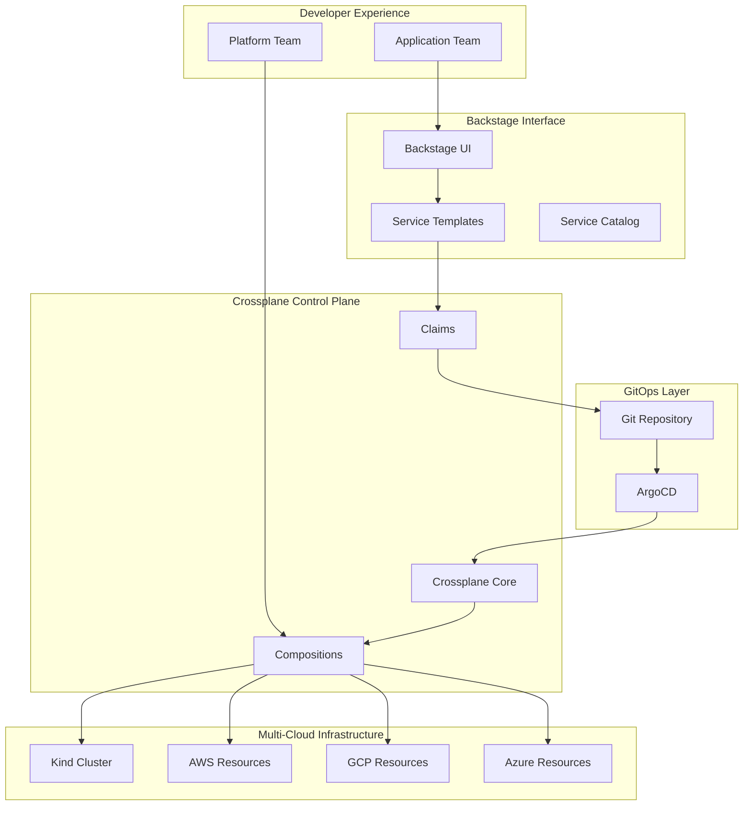

# Multi-Cloud Infrastructure with Crossplane

This example showcases the complete multi-cloud infrastructure automation using Crossplane with support for all 4 hyperscalers (Kind, AWS, GCP, Azure), demonstrating advanced composition patterns, GitOps integration, and production-grade resource management.

## What This Example Shows

- Multi-hyperscaler infrastructure provisioning
- Advanced Crossplane compositions and claims
- GitOps-driven infrastructure management
- Resource lifecycle automation
- Cost optimization and policy enforcement
- Disaster recovery and multi-region deployment

## Architecture Overview



## Prerequisites

- IDP Stack with Crossplane installed
- Cloud provider credentials configured
- ArgoCD and GitOps repository setup
- kubectl access to management cluster

## Quick Start

```bash
# 1. Navigate to this example
cd examples/advanced/multi-cloud-infrastructure

# 2. Configure cloud providers
cp .env.example .env
# Edit .env with your cloud credentials

# 3. Run the complete example
./run-example.sh

# 4. Monitor deployment progress
kubectl get claims,xrd,compositions -A
```

## Example Structure

```
multi-cloud-infrastructure/
├── README.md                           # This file
├── .env.example                        # Environment template
├── run-example.sh                     # Automated example runner
├── providers/                         # Cloud provider configurations
│   ├── aws-provider.yaml
│   ├── gcp-provider.yaml
│   ├── azure-provider.yaml
│   └── kind-provider.yaml
├── compositions/                      # Crossplane compositions
│   ├── database/
│   │   ├── postgres-composition.yaml
│   │   ├── mysql-composition.yaml
│   │   └── mongodb-composition.yaml
│   ├── messaging/
│   │   ├── kafka-composition.yaml
│   │   ├── rabbitmq-composition.yaml
│   │   └── eventbridge-composition.yaml
│   ├── networking/
│   │   ├── vpc-composition.yaml
│   │   ├── subnet-composition.yaml
│   │   └── load-balancer-composition.yaml
│   └── compute/
│       ├── kubernetes-composition.yaml
│       ├── serverless-composition.yaml
│       └── container-composition.yaml
├── claims/                           # Resource claims (examples)
│   ├── development/
│   ├── staging/
│   └── production/
├── policies/                         # Governance and compliance
│   ├── cost-control.yaml
│   ├── security-baseline.yaml
│   └── resource-quotas.yaml
├── monitoring/                       # Observability configuration
│   ├── prometheus-rules.yaml
│   ├── grafana-dashboards/
│   └── alerting-policies.yaml
└── docs/                            # Detailed documentation
    ├── composition-development.md
    ├── multi-cloud-strategy.md
    └── troubleshooting.md
```

## Advanced Multi-Cloud Compositions

### Universal Database Composition

This composition provisions databases across any hyperscaler:

```yaml
# compositions/database/postgres-composition.yaml
apiVersion: apiextensions.crossplane.io/v1
kind: Composition
metadata:
  name: postgres-universal
  labels:
    provider: multi-cloud
    service: database
    engine: postgresql
spec:
  writeConnectionSecretsToNamespace: crossplane
  
  compositeTypeRef:
    apiVersion: terasky.com/v1alpha1
    kind: XPostgreSQLInstance
    
  resources:
    # Kind LocalDB for development
    - name: kind-postgres
      base:
        apiVersion: postgresql.sql.crossplane.io/v1alpha1
        kind: ProviderConfig
        metadata:
          name: kind-postgres-config
        spec:
          credentials:
            source: Secret
            secretRef:
              namespace: crossplane-system
              name: kind-postgres-creds
              key: credentials
      patches:
        - type: FromCompositeFieldPath
          fromFieldPath: spec.parameters.hyperscaler
          toFieldPath: metadata.name
          transforms:
            - type: string
              string:
                fmt: "%s-postgres-config"
        - type: FromCompositeFieldPath
          fromFieldPath: spec.parameters.hyperscaler
          toFieldPath: spec.forProvider.source
          transforms:
            - type: map
              map:
                kind: "local"
                aws: "rds"
                gcp: "cloudsql"
                azure: "postgresql"
      
    # AWS RDS Instance
    - name: aws-rds
      base:
        apiVersion: rds.aws.crossplane.io/v1alpha1
        kind: RDSInstance
        spec:
          forProvider:
            engine: postgres
            engineVersion: "14.9"
            autoMinorVersionUpgrade: true
            backupRetentionPeriod: 7
            storageEncrypted: true
            multiAZ: true
            publiclyAccessible: false
            storageType: gp3
          writeConnectionSecretsToNamespace: crossplane
      patches:
        - type: FromCompositeFieldPath
          fromFieldPath: spec.parameters.hyperscaler
          toFieldPath: spec.forProvider.region
          policy:
            fromFieldPath: Required
        - type: FromCompositeFieldPath
          fromFieldPath: spec.parameters.size
          toFieldPath: spec.forProvider.dbInstanceClass
          transforms:
            - type: map
              map:
                small: db.t3.micro
                medium: db.t3.small  
                large: db.t3.medium
                xlarge: db.t3.large
        - type: FromCompositeFieldPath
          fromFieldPath: spec.parameters.storage
          toFieldPath: spec.forProvider.allocatedStorage
        - type: FromCompositeFieldPath
          fromFieldPath: spec.parameters.environment
          toFieldPath: spec.forProvider.tags.Environment
      connectionDetails:
        - type: FromConnectionSecretKey
          name: username
          fromConnectionSecretKey: username
        - type: FromConnectionSecretKey
          name: password
          fromConnectionSecretKey: password
        - type: FromConnectionSecretKey
          name: endpoint
          fromConnectionSecretKey: endpoint
        - type: FromConnectionSecretKey  
          name: port
          fromConnectionSecretKey: port
    
    # Google Cloud SQL
    - name: gcp-cloudsql
      base:
        apiVersion: sql.gcp.crossplane.io/v1beta1
        kind: DatabaseInstance
        spec:
          forProvider:
            databaseVersion: POSTGRES_14
            region: us-central1
            settings:
              tier: db-f1-micro
              ipConfiguration:
                requireSsl: true
                authorizedNetworks: []
              backupConfiguration:
                enabled: true
                startTime: "03:00"
                pointInTimeRecoveryEnabled: true
              maintenanceWindow:
                hour: 4
                day: 7
          writeConnectionSecretsToNamespace: crossplane
      patches:
        - type: FromCompositeFieldPath
          fromFieldPath: spec.parameters.hyperscaler  
          toFieldPath: spec.forProvider.region
          policy:
            fromFieldPath: Required
        - type: FromCompositeFieldPath
          fromFieldPath: spec.parameters.size
          toFieldPath: spec.forProvider.settings.tier
          transforms:
            - type: map
              map:
                small: db-f1-micro
                medium: db-g1-small
                large: db-n1-standard-1
                xlarge: db-n1-standard-2
                
    # Azure Database for PostgreSQL
    - name: azure-postgres
      base:
        apiVersion: dbforpostgresql.azure.crossplane.io/v1beta1
        kind: Server
        spec:
          forProvider:
            administratorLogin: postgres
            version: "14"
            sslEnforcement: Enabled
            minimalTlsVersion: TLS1_2
            infrastructureEncryption: Enabled
            publicNetworkAccess: Disabled
            storageProfile:
              backupRetentionDays: 7
              geoRedundantBackup: Enabled
              storageAutogrow: Enabled
          writeConnectionSecretsToNamespace: crossplane
      patches:
        - type: FromCompositeFieldPath
          fromFieldPath: spec.parameters.hyperscaler
          toFieldPath: spec.forProvider.location
          policy:
            fromFieldPath: Required
        - type: FromCompositeFieldPath
          fromFieldPath: spec.parameters.size
          toFieldPath: spec.forProvider.sku.name
          transforms:
            - type: map
              map:
                small: B_Gen5_1
                medium: GP_Gen5_2
                large: GP_Gen5_4
                xlarge: GP_Gen5_8
        - type: FromCompositeFieldPath
          fromFieldPath: spec.parameters.storage
          toFieldPath: spec.forProvider.storageProfile.storageMB
          transforms:
            - type: convert
              convert:
                toType: int
```

### Composite Resource Definition (XRD)

```yaml
# compositions/database/postgres-xrd.yaml
apiVersion: apiextensions.crossplane.io/v1
kind: CompositeResourceDefinition
metadata:
  name: xpostgresqlinstances.terasky.com
spec:
  group: terasky.com
  versions:
    - name: v1alpha1
      served: true
      referenceable: true
      schema:
        openAPIV3Schema:
          type: object
          properties:
            spec:
              type: object
              properties:
                parameters:
                  type: object
                  properties:
                    hyperscaler:
                      type: string
                      enum: [kind, aws, gcp, azure]
                      description: Target cloud provider
                    size:
                      type: string
                      enum: [small, medium, large, xlarge]
                      default: small
                      description: Database instance size
                    storage:
                      type: integer
                      minimum: 20
                      maximum: 1000
                      default: 20
                      description: Storage size in GB
                    environment:
                      type: string
                      enum: [dev, staging, prod]
                      default: dev
                      description: Environment classification
                    version:
                      type: string
                      default: "14"
                      description: PostgreSQL version
                    region:
                      type: string
                      description: Deployment region
                    networkConfig:
                      type: object
                      properties:
                        publicAccess:
                          type: boolean
                          default: false
                        allowedNetworks:
                          type: array
                          items:
                            type: string
                    backupConfig:
                      type: object
                      properties:
                        enabled:
                          type: boolean
                          default: true
                        retentionDays:
                          type: integer
                          default: 7
                          minimum: 1
                          maximum: 35
                        pointInTimeRecovery:
                          type: boolean
                          default: true
                  required: [hyperscaler, environment]
              required: [parameters]
            status:
              type: object
              properties:
                connectionDetails:
                  type: object
                  properties:
                    endpoint:
                      type: string
                    port:
                      type: string
                    database:
                      type: string
                conditions:
                  type: array
                  items:
                    type: object
                    properties:
                      type:
                        type: string
                      status:
                        type: string
                      reason:
                        type: string
                      message:
                        type: string
  names:
    kind: XPostgreSQLInstance
    plural: xpostgresqlinstances
  claimNames:
    kind: PostgreSQLInstance
    plural: postgresqlinstances
```

## Real-World Usage Examples

### Development Environment Setup

```yaml
# claims/development/dev-database-claim.yaml
apiVersion: terasky.com/v1alpha1
kind: PostgreSQLInstance
metadata:
  name: dev-app-db
  namespace: development
spec:
  parameters:
    hyperscaler: kind
    size: small
    storage: 20
    environment: dev
    version: "14"
    networkConfig:
      publicAccess: true
  compositionRef:
    name: postgres-universal
  writeConnectionSecretsToNamespace: development
  writeConnectionSecretsToName: dev-app-db-connection
```

### Production Multi-Region Setup

```yaml
# claims/production/prod-database-cluster-claim.yaml
apiVersion: terasky.com/v1alpha1  
kind: PostgreSQLInstance
metadata:
  name: prod-primary-db
  namespace: production
spec:
  parameters:
    hyperscaler: aws
    size: xlarge
    storage: 500
    environment: prod
    version: "14"
    region: us-east-1
    networkConfig:
      publicAccess: false
      allowedNetworks:
        - "10.0.0.0/16"
    backupConfig:
      enabled: true
      retentionDays: 30
      pointInTimeRecovery: true
  compositionRef:
    name: postgres-universal
  writeConnectionSecretsToNamespace: production
  writeConnectionSecretsToName: prod-primary-db-connection

---
apiVersion: terasky.com/v1alpha1
kind: PostgreSQLInstance
metadata:
  name: prod-replica-db
  namespace: production
spec:
  parameters:
    hyperscaler: gcp
    size: xlarge
    storage: 500
    environment: prod
    version: "14"
    region: us-central1
    networkConfig:
      publicAccess: false
  compositionRef:
    name: postgres-universal
  writeConnectionSecretsToNamespace: production
  writeConnectionSecretsToName: prod-replica-db-connection
```

## Advanced Monitoring and Observability

### Crossplane Resource Monitoring

```yaml
# monitoring/prometheus-rules.yaml
apiVersion: monitoring.coreos.com/v1
kind: PrometheusRule
metadata:
  name: crossplane-multi-cloud-monitoring
  namespace: crossplane-system
spec:
  groups:
    - name: crossplane.infrastructure
      rules:
        - alert: CompositeResourceFailed
          expr: crossplane_composite_resource_ready{condition="False"} == 1
          for: 5m
          labels:
            severity: critical
            team: platform
          annotations:
            summary: "Composite resource {{ $labels.name }} failed"
            description: "Composite resource {{ $labels.name }} in namespace {{ $labels.namespace }} has been in failed state for more than 5 minutes"
            runbook_url: "https://docs.example.com/runbooks/crossplane/composite-resource-failed"
            
        - alert: ManagedResourceSyncFailure
          expr: rate(crossplane_managed_resource_syncs_total{condition="SyncError"}[5m]) > 0
          for: 2m
          labels:
            severity: warning  
            team: platform
          annotations:
            summary: "Managed resource sync failures detected"
            description: "Managed resource {{ $labels.name }} is experiencing sync failures"
            
        - alert: CrossplaneProviderUnhealthy
          expr: crossplane_provider_healthy == 0
          for: 3m
          labels:
            severity: critical
            team: platform
          annotations:
            summary: "Crossplane provider {{ $labels.provider }} is unhealthy"
            description: "Provider {{ $labels.provider }} has been unhealthy for more than 3 minutes"
            
        - alert: MultiCloudCostAnomaly  
          expr: increase(crossplane_resource_cost_estimate[1h]) > 100
          labels:
            severity: warning
            team: finops
          annotations:
            summary: "Unusual cost increase detected"
            description: "Resource costs have increased by more than $100 in the last hour"
```

### Grafana Dashboard Configuration

```json
{
  "dashboard": {
    "title": "Multi-Cloud Infrastructure Overview",
    "panels": [
      {
        "title": "Resource Status by Provider",
        "type": "stat",
        "targets": [
          {
            "expr": "count by (provider) (crossplane_composite_resource_ready == 1)"
          }
        ]
      },
      {
        "title": "Infrastructure Cost Trends",
        "type": "graph", 
        "targets": [
          {
            "expr": "sum by (hyperscaler) (crossplane_resource_cost_estimate)"
          }
        ]
      },
      {
        "title": "Resource Provisioning Time",
        "type": "heatmap",
        "targets": [
          {
            "expr": "histogram_quantile(0.95, crossplane_resource_provision_duration_seconds)"
          }
        ]
      }
    ]
  }
}
```

## Governance and Policy Enforcement

### Cost Control Policies

```yaml
# policies/cost-control.yaml
apiVersion: pkg.crossplane.io/v1alpha1
kind: ControllerConfig
metadata:
  name: cost-control-config
spec:
  args:
    - --enable-management-policies
  env:
    - name: MAX_MONTHLY_COST
      value: "10000"
    - name: COST_ALERT_THRESHOLD  
      value: "0.8"
      
---
apiVersion: apiextensions.crossplane.io/v1
kind: Composition
metadata:
  name: cost-aware-database
spec:
  writeConnectionSecretsToNamespace: crossplane
  compositeTypeRef:
    apiVersion: terasky.com/v1alpha1
    kind: XCostAwareDatabase
  functions:
    - name: cost-validation
      type: function
      step: pre-create
      input:
        apiVersion: terasky.com/v1alpha1
        kind: CostValidation
        spec:
          maxMonthlyCost: 1000
          requireApproval: true
          approvers:
            - platform-team
            - finops-team
```

### Security Baseline Enforcement

```yaml
# policies/security-baseline.yaml  
apiVersion: pkg.crossplane.io/v1alpha1
kind: ControllerConfig
metadata:
  name: security-baseline-config
spec:
  securityContext:
    runAsNonRoot: true
    runAsUser: 65532
    allowPrivilegeEscalation: false
    capabilities:
      drop: ["ALL"]
  env:
    - name: ENFORCE_ENCRYPTION
      value: "true"
    - name: MINIMUM_TLS_VERSION
      value: "1.2"
    - name: REQUIRE_NETWORK_POLICIES
      value: "true"
```

## Automated Deployment with ArgoCD

### GitOps Integration

```yaml
# argocd/multi-cloud-infrastructure-app.yaml
apiVersion: argoproj.io/v1alpha1
kind: Application
metadata:
  name: multi-cloud-infrastructure
  namespace: argocd
spec:
  project: platform
  source:
    repoURL: https://github.com/your-org/idp-stack-gitops
    targetRevision: HEAD
    path: infrastructure/crossplane
  destination:
    server: https://kubernetes.default.svc
    namespace: crossplane-system
  syncPolicy:
    automated:
      prune: true
      selfHeal: true
      allowEmpty: false
    syncOptions:
      - CreateNamespace=true
      - PruneLast=true
    retry:
      limit: 5
      backoff:
        duration: 5s
        factor: 2
        maxDuration: 3m
  ignoreDifferences:
    - group: apiextensions.crossplane.io
      kind: Composition
      jsonPointers:
        - /metadata/annotations/crossplane.io/composition-resource-name
```

## Success Metrics

After running this example, you should see:

- All 4 hyperscaler providers configured and healthy
- Universal compositions for databases, messaging, networking
- Resource claims deployed across different environments
- GitOps integration with ArgoCD automation
- Cost and security policies enforced
- Comprehensive monitoring and alerting active
- Multi-region deployment patterns demonstrated

## Troubleshooting

### Common Issues

**Provider Authentication Failures**
```bash
# Check provider status
kubectl get providers

# Verify credentials
kubectl get secret -n crossplane-system aws-creds -o yaml

# Test provider connectivity
kubectl describe providerconfig aws-config
```

**Composition Resource Failures**
```bash
# Check managed resources
kubectl get managed

# Debug specific resource
kubectl describe rdsinstance <instance-name>

# View controller logs
kubectl logs -n crossplane-system -l app=crossplane
```

**Cross-Region Networking Issues**
```bash
# Verify network policies
kubectl get networkpolicies -A

# Check VPC peering status
kubectl get xvpc -o yaml

# Test connectivity
kubectl run debug --image=nicolaka/netshoot -it --rm
```

## Next Steps

1. **Custom Compositions** - Develop organization-specific infrastructure patterns
2. **Policy Integration** - Implement OPA Gatekeeper integration
3. **Cost Optimization** - Set up automated cost analysis and recommendations
4. **Disaster Recovery** - Implement cross-region backup and failover
5. **Compliance Reporting** - Generate infrastructure compliance reports

## 📚 Related Examples

- [Production Backstage](../production-backstage/) - Service catalog integration
- [Advanced Application Lifecycles](../application-lifecycles/) - Complete deployment pipelines
- [GitOps Workflows](../../workflows/gitops/) - Advanced GitOps patterns

## 🤝 Contributing

Found improvements or issues? Please:

1. Test across all supported hyperscalers
2. Verify cost and security implications
3. Update documentation with real-world usage
4. Submit detailed pull request with validation results
