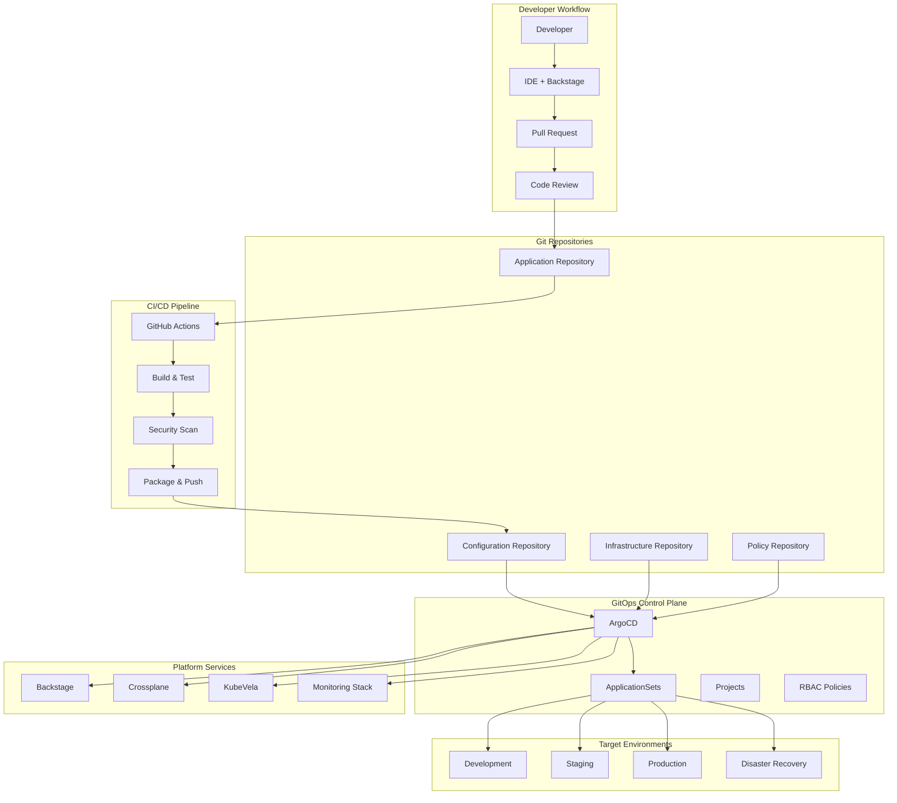

# Complete GitOps Workflow Integration

This comprehensive example demonstrates the complete GitOps workflow integration with ArgoCD, showcasing advanced GitOps patterns, multi-environment promotion, application lifecycle management, and production-grade automation across the entire IDP Stack.

## What This Example Shows

- Complete GitOps workflow with ArgoCD and Git-based operations
- Advanced application lifecycle management with Git-driven deployments
- Multi-environment promotion with approval gates and automation
- Infrastructure as Code with GitOps integration
- Comprehensive security and compliance in GitOps workflows
- Production-grade monitoring and observability for GitOps operations
- Disaster recovery and rollback procedures

## GitOps Architecture Overview



## Prerequisites

- IDP Stack with ArgoCD installed and configured
- GitHub or GitLab repository access
- Multi-environment Kubernetes clusters
- Docker registry for image storage
- Monitoring stack deployed

## Quick Start

```bash
# 1. Navigate to this example
cd examples/workflows/gitops

# 2. Configure Git repositories
cp .env.example .env
# Edit .env with your Git and registry configuration

# 3. Initialize GitOps repositories
./setup-gitops-repositories.sh

# 4. Deploy the complete GitOps workflow
./deploy-gitops-workflow.sh

# 5. Monitor GitOps operations
./monitor-gitops-deployments.sh
```

## Comprehensive Example Structure

```
gitops/
├── README.md                          # This file
├── .env.example                       # Environment template
├── setup-gitops-repositories.sh      # Repository initialization
├── deploy-gitops-workflow.sh         # Complete workflow deployment
├── monitor-gitops-deployments.sh     # GitOps monitoring script
├── repositories/                      # Git repository structures
│   ├── application-repo/
│   │   ├── src/
│   │   ├── .github/workflows/
│   │   ├── Dockerfile
│   │   ├── helm/
│   │   └── tests/
│   ├── config-repo/
│   │   ├── environments/
│   │   │   ├── development/
│   │   │   ├── staging/
│   │   │   └── production/
│   │   ├── applications/
│   │   ├── infrastructure/
│   │   └── policies/
│   ├── infrastructure-repo/
│   │   ├── crossplane/
│   │   ├── monitoring/
│   │   ├── security/
│   │   └── networking/
│   └── policy-repo/
│       ├── rbac/
│       ├── network-policies/
│       ├── security-policies/
│       └── compliance/
├── argocd/                           # ArgoCD configurations
│   ├── projects/
│   │   ├── platform-project.yaml
│   │   ├── applications-project.yaml
│   │   └── infrastructure-project.yaml
│   ├── applications/
│   │   ├── app-of-apps.yaml
│   │   ├── application-sets.yaml
│   │   └── individual-apps/
│   ├── repositories/
│   │   ├── repository-credentials.yaml
│   │   └── repository-configs.yaml
│   ├── rbac/
│   │   ├── rbac-config.yaml
│   │   ├── team-policies.yaml
│   │   └── service-accounts.yaml
│   └── notifications/
│       ├── notification-config.yaml
│       ├── triggers.yaml
│       └── templates.yaml
├── workflows/                        # CI/CD workflow templates
│   ├── github-actions/
│   │   ├── build-and-deploy.yml
│   │   ├── security-scan.yml
│   │   ├── promote-environment.yml
│   │   └── rollback.yml
│   ├── gitlab-ci/
│   │   ├── .gitlab-ci.yml
│   │   ├── build-stage.yml
│   │   ├── test-stage.yml
│   │   └── deploy-stage.yml
│   └── tekton/
│       ├── tasks/
│       ├── pipelines/
│       └── triggers/
├── promotion/                        # Environment promotion workflows
│   ├── promotion-rules.yaml
│   ├── approval-workflows.yaml
│   ├── automated-promotion.yaml
│   └── rollback-procedures.yaml
├── monitoring/                       # GitOps monitoring and observability
│   ├── prometheus/
│   │   ├── argocd-metrics.yaml
│   │   ├── gitops-alerts.yaml
│   │   └── deployment-metrics.yaml
│   ├── grafana/
│   │   ├── argocd-dashboard.json
│   │   ├── gitops-overview.json
│   │   └── deployment-trends.json
│   └── notifications/
│       ├── slack-integration.yaml
│       ├── email-templates.yaml
│       └── webhook-configs.yaml
├── security/                         # GitOps security and compliance
│   ├── git-signing/
│   │   ├── gpg-keys.yaml
│   │   ├── commit-signing.yaml
│   │   └── verification-policies.yaml
│   ├── admission-control/
│   │   ├── opa-policies.yaml
│   │   ├── gatekeeper-constraints.yaml
│   │   └── policy-violations.yaml
│   ├── secrets-management/
│   │   ├── sealed-secrets.yaml
│   │   ├── external-secrets.yaml
│   │   └── vault-integration.yaml
│   └── compliance/
│       ├── policy-as-code.yaml
│       ├── audit-logging.yaml
│       └── compliance-reports.yaml
├── disaster-recovery/                # DR and backup procedures
│   ├── backup-strategies.yaml
│   ├── restore-procedures.yaml
│   ├── multi-cluster-sync.yaml
│   └── disaster-recovery-tests.yaml
└── docs/                            # Comprehensive documentation
    ├── gitops-best-practices.md
    ├── environment-promotion.md
    ├── troubleshooting-guide.md
    ├── security-guidelines.md
    └── disaster-recovery-runbook.md
```

## 🎨 Advanced ArgoCD Configuration

### App-of-Apps Pattern with ApplicationSets

```yaml
# argocd/applications/app-of-apps.yaml
apiVersion: argoproj.io/v1alpha1
kind: Application
metadata:
  name: platform-app-of-apps
  namespace: argocd
  finalizers:
    - resources-finalizer.argocd.argoproj.io
spec:
  project: platform
  source:
    repoURL: https://github.com/your-org/idp-config-repo
    targetRevision: HEAD
    path: argocd/applications
  destination:
    server: https://kubernetes.default.svc
    namespace: argocd
  syncPolicy:
    automated:
      prune: true
      selfHeal: true
      allowEmpty: false
    syncOptions:
      - CreateNamespace=true
      - PruneLast=true
      - ApplyOutOfSyncOnly=true
    retry:
      limit: 5
      backoff:
        duration: 5s
        factor: 2
        maxDuration: 3m
  ignoreDifferences:
    - group: argoproj.io
      kind: Application
      jsonPointers:
        - /spec/source/targetRevision
        - /spec/source/helm/parameters

---
apiVersion: argoproj.io/v1alpha1
kind: ApplicationSet
metadata:
  name: platform-services-applicationset
  namespace: argocd
spec:
  generators:
    - git:
        repoURL: https://github.com/your-org/idp-config-repo
        revision: HEAD
        directories:
          - path: environments/*/platform-services
        template:
          metadata: {}
          spec:
            project: platform
            source:
              repoURL: https://github.com/your-org/idp-config-repo
              targetRevision: HEAD
              path: '{{path}}'
            destination:
              server: https://kubernetes.default.svc
              namespace: '{{path.basename}}'
  template:
    metadata:
      name: '{{path[1]}}-platform-services'
      labels:
        environment: '{{path[1]}}'
        component: platform-services
      annotations:
        argocd.argoproj.io/sync-wave: "0"
    spec:
      project: platform
      source:
        repoURL: https://github.com/your-org/idp-config-repo
        targetRevision: HEAD
        path: '{{path}}'
      destination:
        server: https://kubernetes.default.svc
        namespace: '{{path[1]}}'
      syncPolicy:
        automated:
          prune: true
          selfHeal: true
        syncOptions:
          - CreateNamespace=true
          - ApplyOutOfSyncOnly=true
        retry:
          limit: 3
          backoff:
            duration: 5s
            factor: 2
            maxDuration: 2m

---
apiVersion: argoproj.io/v1alpha1
kind: ApplicationSet
metadata:
  name: microservices-applicationset
  namespace: argocd
spec:
  generators:
    - clusters:
        selector:
          matchLabels:
            environment: production
    - git:
        repoURL: https://github.com/your-org/microservices-config
        revision: HEAD
        directories:
          - path: applications/*
        template:
          metadata: {}
          spec: {}
  template:
    metadata:
      name: '{{path.basename}}-{{name}}'
      labels:
        app: '{{path.basename}}'
        environment: '{{metadata.labels.environment}}'
        cluster: '{{name}}'
      annotations:
        argocd.argoproj.io/sync-wave: "10"
        notifications.argoproj.io/subscribe.on-sync-succeeded.slack: deployment-notifications
        notifications.argoproj.io/subscribe.on-sync-failed.slack: deployment-alerts
    spec:
      project: applications
      source:
        repoURL: https://github.com/your-org/microservices-config
        targetRevision: HEAD
        path: 'applications/{{path.basename}}'
        helm:
          valueFiles:
            - values.yaml
            - 'values-{{metadata.labels.environment}}.yaml'
          parameters:
            - name: image.tag
              value: '{{metadata.annotations.image-tag}}'
            - name: environment
              value: '{{metadata.labels.environment}}'
            - name: cluster
              value: '{{name}}'
      destination:
        server: '{{server}}'
        namespace: '{{path.basename}}'
      syncPolicy:
        automated:
          prune: true
          selfHeal: false  # Require manual approval for production
        syncOptions:
          - CreateNamespace=true
          - RespectIgnoreDifferences=true
        retry:
          limit: 2
          backoff:
            duration: 10s
            factor: 2
            maxDuration: 3m
      ignoreDifferences:
        - group: apps
          kind: Deployment
          jsonPointers:
            - /spec/replicas
        - group: autoscaling
          kind: HorizontalPodAutoscaler
          jsonPointers:
            - /spec/minReplicas
            - /spec/maxReplicas
```

### Advanced RBAC Configuration

```yaml
# argocd/rbac/rbac-config.yaml
apiVersion: v1
kind: ConfigMap
metadata:
  name: argocd-rbac-cm
  namespace: argocd
  labels:
    app.kubernetes.io/name: argocd-rbac-cm
    app.kubernetes.io/part-of: argocd
data:
  policy.default: role:readonly
  policy.csv: |
    # Platform Team - Full Access
    p, role:platform-admin, applications, *, */*, allow
    p, role:platform-admin, clusters, *, *, allow
    p, role:platform-admin, repositories, *, *, allow
    p, role:platform-admin, projects, *, *, allow
    p, role:platform-admin, certificates, *, *, allow
    p, role:platform-admin, accounts, *, *, allow
    p, role:platform-admin, gpgkeys, *, *, allow
    
    # Development Team - Application Management
    p, role:developer, applications, get, development/*, allow
    p, role:developer, applications, create, development/*, allow
    p, role:developer, applications, update, development/*, allow
    p, role:developer, applications, delete, development/*, allow
    p, role:developer, applications, sync, development/*, allow
    p, role:developer, applications, override, development/*, allow
    p, role:developer, applications, action/*, development/*, allow
    p, role:developer, repositories, get, *, allow
    p, role:developer, projects, get, applications, allow
    
    # DevOps Team - Multi-Environment Management
    p, role:devops, applications, *, development/*, allow
    p, role:devops, applications, *, staging/*, allow
    p, role:devops, applications, get, production/*, allow
    p, role:devops, applications, sync, production/*, allow
    p, role:devops, repositories, *, *, allow
    p, role:devops, projects, get, *, allow
    p, role:devops, clusters, get, *, allow
    
    # SRE Team - Production Operations
    p, role:sre, applications, get, */*, allow
    p, role:sre, applications, sync, production/*, allow
    p, role:sre, applications, rollback, production/*, allow
    p, role:sre, applications, action/restart, production/*, allow
    p, role:sre, clusters, get, *, allow
    p, role:sre, repositories, get, *, allow
    p, role:sre, projects, get, *, allow
    
    # Security Team - Read-Only Audit Access
    p, role:security-audit, applications, get, */*, allow
    p, role:security-audit, clusters, get, *, allow
    p, role:security-audit, repositories, get, *, allow
    p, role:security-audit, projects, get, *, allow
    p, role:security-audit, logs, get, */*, allow
    p, role:security-audit, exec, deny, */*, allow
    
    # Read-Only Role
    p, role:readonly, applications, get, */*, allow
    p, role:readonly, repositories, get, *, allow
    p, role:readonly, projects, get, *, allow
    p, role:readonly, clusters, get, *, allow
    
    # Group Mappings
    g, platform-team, role:platform-admin
    g, development-team, role:developer
    g, devops-team, role:devops
    g, sre-team, role:sre
    g, security-team, role:security-audit
    g, stakeholders, role:readonly
    
    # Individual User Overrides
    g, alice@company.com, role:platform-admin
    g, bob@company.com, role:devops
    g, charlie@company.com, role:sre
    g, diana@company.com, role:developer
    
  # OIDC Configuration for SSO
  oidc.config: |
    name: Company SSO
    issuer: https://company.okta.com/oauth2/default
    clientId: argocd-client-id
    clientSecret: $oidc.company.clientSecret
    requestedScopes: ["openid", "profile", "email", "groups"]
    requestedIDTokenClaims: {"groups": {"essential": true}}
  
  # URL-based access control
  url: https://argocd.company.com
  dex.config: |
    connectors:
      - type: oidc
        id: company-sso
        name: Company SSO
        config:
          issuer: https://company.okta.com/oauth2/default
          clientID: argocd-client-id
          clientSecret: $dex.company.clientSecret
          requestedScopes: ["openid", "profile", "email", "groups"]
          requestedIDTokenClaims:
            groups:
              essential: true
```

### Advanced Project Configuration

```yaml
# argocd/projects/applications-project.yaml
apiVersion: argoproj.io/v1alpha1
kind: AppProject
metadata:
  name: applications
  namespace: argocd
  finalizers:
    - resources-finalizer.argocd.argoproj.io
spec:
  description: Project for application deployments across all environments
  
  sourceRepos:
    - 'https://github.com/your-org/microservices-config'
    - 'https://github.com/your-org/frontend-apps'
    - 'https://github.com/your-org/data-pipelines'
    - 'https://helm-charts.company.com/*'
    - 'https://ghcr.io/your-org/*'
  
  destinations:
    - namespace: 'development'
      server: https://kubernetes.default.svc
    - namespace: 'staging'
      server: https://dev-cluster.company.com
    - namespace: 'production'
      server: https://prod-cluster.company.com
    - namespace: 'disaster-recovery'
      server: https://dr-cluster.company.com
  
  clusterResourceWhitelist:
    - group: ''
      kind: Namespace
    - group: rbac.authorization.k8s.io
      kind: ClusterRole
    - group: rbac.authorization.k8s.io
      kind: ClusterRoleBinding
    - group: apiextensions.k8s.io
      kind: CustomResourceDefinition
    - group: networking.k8s.io
      kind: NetworkPolicy
    - group: policy
      kind: PodSecurityPolicy
  
  namespaceResourceWhitelist:
    - group: ''
      kind: ConfigMap
    - group: ''
      kind: Secret
    - group: ''
      kind: Service
    - group: ''
      kind: ServiceAccount
    - group: apps
      kind: Deployment
    - group: apps
      kind: StatefulSet
    - group: apps
      kind: DaemonSet
    - group: apps
      kind: ReplicaSet
    - group: batch
      kind: Job
    - group: batch
      kind: CronJob
    - group: extensions
      kind: Ingress
    - group: networking.k8s.io
      kind: Ingress
    - group: autoscaling
      kind: HorizontalPodAutoscaler
    - group: policy
      kind: PodDisruptionBudget
    - group: monitoring.coreos.com
      kind: ServiceMonitor
    - group: monitoring.coreos.com
      kind: PrometheusRule
  
  roles:
    - name: developer
      description: Developer access to applications
      policies:
        - p, proj:applications:developer, applications, create, applications/development, allow
        - p, proj:applications:developer, applications, update, applications/development, allow
        - p, proj:applications:developer, applications, delete, applications/development, allow
        - p, proj:applications:developer, applications, sync, applications/development, allow
        - p, proj:applications:developer, applications, get, applications/*, allow
      groups:
        - development-team
    
    - name: devops
      description: DevOps access to development and staging
      policies:
        - p, proj:applications:devops, applications, *, applications/development, allow
        - p, proj:applications:devops, applications, *, applications/staging, allow
        - p, proj:applications:devops, applications, get, applications/production, allow
        - p, proj:applications:devops, applications, sync, applications/production, allow
      groups:
        - devops-team
    
    - name: sre
      description: SRE access to production operations
      policies:
        - p, proj:applications:sre, applications, get, applications/*, allow
        - p, proj:applications:sre, applications, sync, applications/production, allow
        - p, proj:applications:sre, applications, rollback, applications/production, allow
      groups:
        - sre-team
  
  syncWindows:
    - kind: allow
      schedule: '0 9-17 * * MON-FRI'
      duration: 8h
      applications:
        - '*'
      namespaces:
        - development
        - staging
      clusters:
        - https://kubernetes.default.svc
        - https://dev-cluster.company.com
    
    - kind: deny
      schedule: '0 18-8 * * *'
      duration: 14h
      applications:
        - 'production-*'
      namespaces:
        - production
      clusters:
        - https://prod-cluster.company.com
      manualSync: true
  
  orphanedResources:
    warn: true
    ignore:
      - group: apps
        kind: ReplicaSet
        name: '*'
      - group: ''
        kind: Pod
        name: '*'
  
  signatureKeys:
    - keyID: 1234567890ABCDEF
  
  permitOnlyProjectScopedClusters: false
```

## Advanced CI/CD Integration

### GitHub Actions Workflow with GitOps

```yaml
# workflows/github-actions/build-and-deploy.yml
name: Build and Deploy to GitOps

on:
  push:
    branches: [main, develop, feature/*]
    paths-ignore:
      - 'docs/**'
      - 'README.md'
      - '.gitignore'
  pull_request:
    branches: [main, develop]

env:
  REGISTRY: ghcr.io
  IMAGE_NAME: ${{ github.repository }}

jobs:
  validate:
    name: Validate Changes
    runs-on: ubuntu-latest
    outputs:
      changed-services: ${{ steps.changes.outputs.services }}
      deploy-environment: ${{ steps.environment.outputs.environment }}
    steps:
      - name: Checkout code
        uses: actions/checkout@v4
        with:
          fetch-depth: 0
      
      - name: Detect changed services
        id: changes
        uses: dorny/paths-filter@v2
        with:
          list-files: json
          filters: |
            services:
              - 'services/*/src/**'
              - 'services/*/Dockerfile'
              - 'services/*/helm/**'
      
      - name: Determine deployment environment
        id: environment
        run: |
          if [[ "${{ github.ref }}" == "refs/heads/main" ]]; then
            echo "environment=production" >> $GITHUB_OUTPUT
          elif [[ "${{ github.ref }}" == "refs/heads/develop" ]]; then
            echo "environment=staging" >> $GITHUB_OUTPUT
          else
            echo "environment=development" >> $GITHUB_OUTPUT
          fi
  
  security-scan:
    name: Security Scanning
    runs-on: ubuntu-latest
    needs: validate
    if: ${{ needs.validate.outputs.changed-services == 'true' }}
    steps:
      - name: Checkout code
        uses: actions/checkout@v4
      
      - name: Run Trivy vulnerability scanner
        uses: aquasecurity/trivy-action@master
        with:
          scan-type: 'fs'
          scan-ref: '.'
          format: 'sarif'
          output: 'trivy-results.sarif'
      
      - name: Upload Trivy scan results to GitHub Security tab
        uses: github/codeql-action/upload-sarif@v2
        with:
          sarif_file: 'trivy-results.sarif'
      
      - name: Snyk security scan
        uses: snyk/actions/node@master
        env:
          SNYK_TOKEN: ${{ secrets.SNYK_TOKEN }}
        with:
          args: --severity-threshold=high
  
  build-and-push:
    name: Build and Push Images
    runs-on: ubuntu-latest
    needs: [validate, security-scan]
    if: ${{ needs.validate.outputs.changed-services == 'true' }}
    strategy:
      matrix:
        service: ${{ fromJson(needs.validate.outputs.changed-services) }}
    steps:
      - name: Checkout code
        uses: actions/checkout@v4
      
      - name: Set up Docker Buildx
        uses: docker/setup-buildx-action@v3
      
      - name: Log in to Container Registry
        uses: docker/login-action@v3
        with:
          registry: ${{ env.REGISTRY }}
          username: ${{ github.actor }}
          password: ${{ secrets.GITHUB_TOKEN }}
      
      - name: Extract metadata
        id: meta
        uses: docker/metadata-action@v5
        with:
          images: ${{ env.REGISTRY }}/${{ env.IMAGE_NAME }}/${{ matrix.service }}
          tags: |
            type=ref,event=branch
            type=ref,event=pr
            type=sha,prefix=sha-{{branch}}-
            type=raw,value=latest,enable={{is_default_branch}}
      
      - name: Build and push Docker image
        uses: docker/build-push-action@v5
        with:
          context: services/${{ matrix.service }}
          push: true
          tags: ${{ steps.meta.outputs.tags }}
          labels: ${{ steps.meta.outputs.labels }}
          cache-from: type=gha
          cache-to: type=gha,mode=max
          platforms: linux/amd64,linux/arm64
          build-args: |
            SERVICE_NAME=${{ matrix.service }}
            BUILD_DATE=${{ github.event.head_commit.timestamp }}
            VCS_REF=${{ github.sha }}
            VERSION=${{ github.ref_name }}
  
  update-gitops:
    name: Update GitOps Repository
    runs-on: ubuntu-latest
    needs: [validate, build-and-push]
    if: ${{ needs.validate.outputs.changed-services == 'true' }}
    strategy:
      matrix:
        service: ${{ fromJson(needs.validate.outputs.changed-services) }}
    steps:
      - name: Checkout GitOps repository
        uses: actions/checkout@v4
        with:
          repository: your-org/idp-config-repo
          token: ${{ secrets.GITOPS_TOKEN }}
          path: gitops-repo
      
      - name: Update application configuration
        run: |
          cd gitops-repo
          
          # Determine the target environment
          ENVIRONMENT="${{ needs.validate.outputs.deploy-environment }}"
          
          # Update image tag in the appropriate environment
          IMAGE_TAG="sha-${{ github.ref_name }}-${{ github.sha }}"
          
          # Update using yq or kustomize
          yq eval ".image.tag = \"$IMAGE_TAG\"" \
            -i "environments/$ENVIRONMENT/applications/${{ matrix.service }}/values.yaml"
          
          # Update last deployment info
          yq eval ".metadata.annotations.\"last-deployed-by\" = \"${{ github.actor }}\"" \
            -i "environments/$ENVIRONMENT/applications/${{ matrix.service }}/kustomization.yaml"
          
          yq eval ".metadata.annotations.\"last-deployed-at\" = \"$(date -u +%Y-%m-%dT%H:%M:%SZ)\"" \
            -i "environments/$ENVIRONMENT/applications/${{ matrix.service }}/kustomization.yaml"
          
          yq eval ".metadata.annotations.\"git-commit\" = \"${{ github.sha }}\"" \
            -i "environments/$ENVIRONMENT/applications/${{ matrix.service }}/kustomization.yaml"
      
      - name: Commit and push changes
        run: |
          cd gitops-repo
          
          git config --local user.email "gitops-bot@company.com"
          git config --local user.name "GitOps Bot"
          
          git add .
          git commit -m "Update ${{ matrix.service }} to ${{ github.sha }} in ${{ needs.validate.outputs.deploy-environment }}
          
          Deployed by: ${{ github.actor }}
          Source commit: ${{ github.sha }}
          Environment: ${{ needs.validate.outputs.deploy-environment }}
          Service: ${{ matrix.service }}"
          
          git push
  
  promote-to-staging:
    name: Promote to Staging
    runs-on: ubuntu-latest
    needs: [validate, update-gitops]
    if: ${{ github.ref == 'refs/heads/develop' && needs.validate.outputs.changed-services == 'true' }}
    environment: staging-approval
    steps:
      - name: Wait for ArgoCD sync completion
        run: |
          # Wait for ArgoCD to sync the changes
          sleep 60
          
          # Verify deployment success (implement health check)
          echo "Verifying deployment health..."
      
      - name: Run integration tests
        run: |
          # Run integration tests against staging environment
          echo "Running integration tests..."
      
      - name: Notify stakeholders
        uses: 8398a7/action-slack@v3
        with:
          status: success
          channel: '#deployments'
          text: |
            :white_check_mark: Successfully promoted to staging environment
            
            Services updated: ${{ needs.validate.outputs.changed-services }}
            Commit: ${{ github.sha }}
            Author: ${{ github.actor }}
        env:
          SLACK_WEBHOOK_URL: ${{ secrets.SLACK_WEBHOOK_URL }}
  
  promote-to-production:
    name: Promote to Production
    runs-on: ubuntu-latest
    needs: [validate, promote-to-staging]
    if: ${{ github.ref == 'refs/heads/main' && needs.validate.outputs.changed-services == 'true' }}
    environment: production-approval
    steps:
      - name: Require manual approval
        uses: hmarr/auto-approve-action@v3
        with:
          github-token: ${{ secrets.GITHUB_TOKEN }}
          review-message: "Auto-approving deployment to production"
      
      - name: Checkout GitOps repository
        uses: actions/checkout@v4
        with:
          repository: your-org/idp-config-repo
          token: ${{ secrets.GITOPS_TOKEN }}
          path: gitops-repo
      
      - name: Update production configuration
        run: |
          cd gitops-repo
          
          # Copy staging configuration to production with any necessary overrides
          IMAGE_TAG="sha-main-${{ github.sha }}"
          
          for service in $(echo '${{ needs.validate.outputs.changed-services }}' | jq -r '.[]'); do
            yq eval ".image.tag = \"$IMAGE_TAG\"" \
              -i "environments/production/applications/$service/values.yaml"
            
            # Apply production-specific configurations
            yq eval ".replicaCount = 3" \
              -i "environments/production/applications/$service/values.yaml"
            
            yq eval ".resources.requests.cpu = \"500m\"" \
              -i "environments/production/applications/$service/values.yaml"
            
            yq eval ".resources.requests.memory = \"1Gi\"" \
              -i "environments/production/applications/$service/values.yaml"
          done
      
      - name: Commit production changes
        run: |
          cd gitops-repo
          
          git config --local user.email "gitops-bot@company.com"
          git config --local user.name "GitOps Bot"
          
          git add .
          git commit -m "Promote to production: ${{ needs.validate.outputs.changed-services }}
          
          Source commit: ${{ github.sha }}
          Approved by: ${{ github.actor }}
          Production deployment: $(date -u +%Y-%m-%dT%H:%M:%SZ)"
          
          git push
      
      - name: Notify production deployment
        uses: 8398a7/action-slack@v3
        with:
          status: success
          channel: '#production-deployments'
          text: |
            :rocket: Production deployment initiated
            
            Services: ${{ needs.validate.outputs.changed-services }}
            Commit: ${{ github.sha }}
            Approved by: ${{ github.actor }}
            
            Monitor deployment: https://argocd.company.com
        env:
          SLACK_WEBHOOK_URL: ${{ secrets.SLACK_WEBHOOK_URL }}
```

## Success Metrics

After running this example, you should see:

- Complete GitOps workflow with Git-based operations
- Multi-environment promotion with automated and manual gates
- Advanced ArgoCD configuration with RBAC and security
- Comprehensive CI/CD integration with security scanning
- Production-grade monitoring and observability
- Disaster recovery and rollback procedures
- Policy as code with compliance automation

## Next Steps

1. **Advanced Security Integration** - Implement policy as code with OPA
2. **Multi-Cluster GitOps** - Set up cross-cluster deployments
3. **Automated Rollback** - Implement intelligent rollback strategies
4. **Cost Optimization** - Integrate cost monitoring in GitOps workflows
5. **Compliance Reporting** - Generate automated compliance reports

## 📚 Related Examples

- [Production Backstage](../advanced/production-backstage/) - Service catalog integration
- [Multi-Cloud Infrastructure](../advanced/multi-cloud-infrastructure/) - Infrastructure patterns
- [Advanced Application Lifecycles](../advanced/application-lifecycles/) - Complete deployment pipelines
- [Security and Compliance](../security/compliance/) - Comprehensive security integration

## 🤝 Contributing

Found improvements or issues? Please:

1. Test across different Git providers and CI/CD systems
2. Verify security and compliance controls
3. Validate multi-environment promotion flows
4. Update documentation with real-world usage patterns
5. Submit detailed pull request with comprehensive validation results
