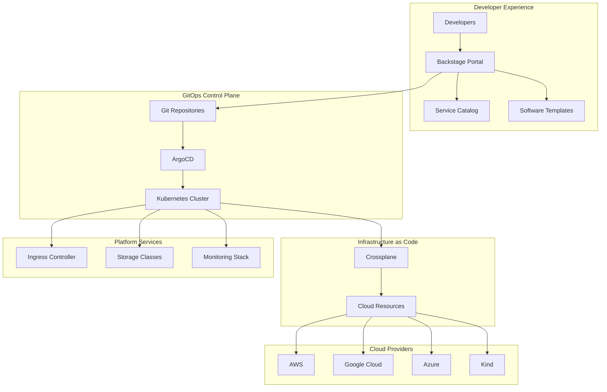

# IDP Builder Architecture Guide

This guide provides a comprehensive overview of the IDP Builder architecture, design patterns, and component interactions.

## Architecture Overview

IDP Builder implements a **GitOps-first, Cloud-native Internal Developer Platform** that follows modern DevOps principles and Kubernetes-native patterns.



## Core Components

### 1. Backstage Developer Portal

**Purpose**: Self-service developer experience and service catalog

**Key Features**:
- **Service Catalog**: Central registry of all services, APIs, and resources
- **Software Templates**: Standardized project scaffolding
- **Tech Docs**: Integrated documentation with docs-as-code
- **CI/CD Integration**: Build and deployment status visibility
- **Team Management**: Service ownership and team organization

**Architecture Pattern**: Micro-frontend with plugin-based extensibility

```yaml
# Component Configuration
apiVersion: v1
kind: ConfigMap
metadata:
  name: backstage-config
data:
  app-config.yaml: |
    app:
      title: IDP Platform
      baseUrl: https://backstage.company.com
    
    catalog:
      providers:
        github:
          providerId: default
          organization: your-org
          schedule:
            frequency: { minutes: 30 }
```

### 2. ArgoCD GitOps Platform

**Purpose**: Continuous deployment and configuration management

**Key Features**:
- **Application Management**: Kubernetes application lifecycle
- **Git Integration**: Git-as-single-source-of-truth
- **Multi-cluster Support**: Deploy to multiple environments
- **RBAC Integration**: Role-based access control
- **Sync Strategies**: Automatic and manual synchronization

**Architecture Pattern**: Hub-and-spoke with multi-cluster management

```yaml
# ArgoCD Application Example
apiVersion: argoproj.io/v1alpha1
kind: Application
metadata:
  name: example-app
  namespace: argocd
spec:
  project: default
  source:
    repoURL: https://github.com/your-org/app-manifests
    targetRevision: main
    path: environments/production
  destination:
    server: https://kubernetes.default.svc
    namespace: production
  syncPolicy:
    automated:
      prune: true
      selfHeal: true
```

### 3. Crossplane Infrastructure Management

**Purpose**: Kubernetes-native infrastructure as code

**Key Features**:
- **Cloud Resource Management**: Provision cloud resources via Kubernetes APIs
- **Composition Engine**: Abstract complex infrastructure patterns
- **Multi-cloud Support**: Unified interface across cloud providers
- **GitOps Integration**: Infrastructure changes via Git workflows
- **Policy Enforcement**: Governance and compliance controls

**Architecture Pattern**: Operator-based with Custom Resource Definitions (CRDs)

```yaml
# Crossplane Composite Resource Definition
apiVersion: apiextensions.crossplane.io/v1
kind: CompositeResourceDefinition
metadata:
  name: xpostgresqlinstances.database.platform.io
spec:
  group: database.platform.io
  versions:
  - name: v1alpha1
    served: true
    referenceable: true
    schema:
      openAPIV3Schema:
        type: object
        properties:
          spec:
            type: object
            properties:
              parameters:
                type: object
                properties:
                  size:
                    type: string
                    enum: ["small", "medium", "large"]
```

### 4. Kubernetes Foundation

**Purpose**: Container orchestration and platform foundation

**Key Components**:
- **Cluster Management**: Multi-node Kubernetes clusters
- **Networking**: Service mesh and ingress controllers
- **Storage**: Persistent volume management
- **Security**: RBAC, Pod Security Standards, Network Policies
- **Observability**: Metrics, logs, and traces collection

**Architecture Pattern**: Layered platform with separation of concerns

## Design Patterns

### 1. GitOps Pattern

**Principle**: Git as the single source of truth for declarative infrastructure and applications


**Benefits**:
- **Audit Trail**: Complete change history in Git
- **Rollback**: Easy rollback to previous states
- **Security**: No direct cluster access required
- **Consistency**: Same process for all environments

### 2. Platform as Code Pattern

**Principle**: Platform configuration and infrastructure defined as code

```bash
# Platform configuration structure
idp-builder/
├── configs/                 # Platform configurations
├── taskfiles/              # Task automation
│   ├── core/               # Core platform tasks
│   ├── infrastructure/     # Infrastructure tasks
│   ├── platform/           # Platform component tasks
│   └── workflows/          # Workflow orchestration
└── charts/                 # Helm charts
```

### 3. Composition Pattern

**Principle**: Complex infrastructure composed from simple, reusable components

```yaml
# Crossplane Composition
apiVersion: apiextensions.crossplane.io/v1
kind: Composition
metadata:
  name: aws-postgresql
spec:
  compositeTypeRef:
    apiVersion: database.platform.io/v1alpha1
    kind: XPostgreSQLInstance
  resources:
  - name: rds-instance
    base:
      apiVersion: rds.aws.crossplane.io/v1alpha1
      kind: RDSInstance
      spec:
        forProvider:
          dbInstanceClass: db.t3.micro
          engine: postgres
    patches:
    - type: FromCompositeFieldPath
      fromFieldPath: spec.parameters.size
      toFieldPath: spec.forProvider.dbInstanceClass
      transforms:
      - type: map
        map:
          small: db.t3.micro
          medium: db.t3.small
          large: db.t3.medium
```

### 4. Self-Service Pattern

**Principle**: Developers can provision and manage resources independently

```yaml
# Backstage Software Template
apiVersion: scaffolder.backstage.io/v1beta3
kind: Template
metadata:
  name: microservice-template
spec:
  parameters:
    - title: Service Configuration
      properties:
        name:
          type: string
          description: Service name
        database:
          type: string
          enum: ["postgres", "mysql", "none"]
  steps:
    - id: fetch
      name: Fetch Base Template
      action: fetch:template
    - id: publish
      name: Create Repository
      action: publish:github
    - id: argocd
      name: Create ArgoCD Application
      action: argocd:create-app
```

## Component Interactions

### 1. Platform Bootstrap Flow


### 2. Application Deployment Flow


### 3. Infrastructure Provisioning Flow


## Security Architecture

### 1. Authentication and Authorization

**Multi-layered Security Model**:

```yaml
# RBAC Configuration
apiVersion: rbac.authorization.k8s.io/v1
kind: ClusterRole
metadata:
  name: platform-developer
rules:
- apiGroups: [""]
  resources: ["pods", "services"]
  verbs: ["get", "list", "create"]
- apiGroups: ["argoproj.io"]
  resources: ["applications"]
  verbs: ["get", "list", "create", "update"]
```

### 2. Network Security

**Zero-Trust Network Architecture**:
- **Service Mesh**: Istio for service-to-service encryption
- **Network Policies**: Kubernetes network segmentation
- **Ingress Security**: TLS termination and WAF protection
- **Pod Security**: Pod Security Standards enforcement

### 3. Secrets Management

**Integrated Secrets Handling**:
```yaml
# External Secrets Operator
apiVersion: external-secrets.io/v1beta1
kind: SecretStore
metadata:
  name: vault-backend
spec:
  provider:
    vault:
      server: "https://vault.company.com"
      path: "secret"
      auth:
        kubernetes:
          mountPath: "kubernetes"
          role: "external-secrets"
```

## Scalability and Performance

### 1. Horizontal Scaling

**Auto-scaling Configuration**:
```yaml
# Horizontal Pod Autoscaler
apiVersion: autoscaling/v2
kind: HorizontalPodAutoscaler
metadata:
  name: backstage-hpa
spec:
  scaleTargetRef:
    apiVersion: apps/v1
    kind: Deployment
    name: backstage
  minReplicas: 2
  maxReplicas: 10
  metrics:
  - type: Resource
    resource:
      name: cpu
      target:
        type: Utilization
        averageUtilization: 70
```

### 2. Multi-cluster Architecture

**Hub and Spoke Model**:
- **Management Cluster**: ArgoCD, Backstage, Crossplane control plane
- **Workload Clusters**: Application deployments
- **Cross-cluster Networking**: Service mesh federation

## Monitoring and Observability

### 1. Three Pillars of Observability

**Metrics, Logs, and Traces**:
```yaml
# Prometheus ServiceMonitor
apiVersion: monitoring.coreos.com/v1
kind: ServiceMonitor
metadata:
  name: backstage-metrics
spec:
  selector:
    matchLabels:
      app: backstage
  endpoints:
  - port: http
    path: /metrics
```

### 2. Platform Health Monitoring

**Key Performance Indicators**:
- **Platform Availability**: Uptime of core components
- **Deployment Frequency**: GitOps deployment metrics  
- **Lead Time**: Time from commit to production
- **Mean Time to Recovery**: Incident resolution time

## Disaster Recovery

### 1. Backup Strategy

**Multi-layer Backup Approach**:
- **Etcd Snapshots**: Kubernetes state backup
- **Git Repositories**: Configuration and infrastructure code
- **Persistent Volumes**: Application data backup
- **Secrets**: Encrypted secrets backup

### 2. Recovery Procedures

**Automated Recovery Workflows**:
```bash
# Platform disaster recovery
task workflows:disaster-recovery \
  CLUSTER_NAME=production \
  BACKUP_DATE=2024-01-15 \
  RESTORE_TYPE=full
```

## Extension Points

### 1. Custom Resources

**Platform-specific CRDs**:
```yaml
# Custom Application Resource
apiVersion: apiextensions.k8s.io/v1
kind: CustomResourceDefinition
metadata:
  name: platformapps.platform.io
spec:
  group: platform.io
  versions:
  - name: v1alpha1
    served: true
    storage: true
    schema:
      openAPIV3Schema:
        type: object
        properties:
          spec:
            type: object
            properties:
              template:
                type: string
              environment:
                type: string
```

### 2. Backstage Plugins

**Custom Platform Plugins**:
```typescript
// Custom plugin structure
export const platformPlugin = createPlugin({
  id: 'platform',
  routes: {
    root: rootRouteRef,
  },
});

export const PlatformPage = platformPlugin.provide(
  createRoutableExtension({
    name: 'PlatformPage',
    component: () => import('./components/PlatformPage').then(m => m.PlatformPage),
    mountPoint: rootRouteRef,
  }),
);
```

## Best Practices

### 1. Configuration Management

- **Environment Parity**: Consistent configuration across environments
- **Secret Rotation**: Regular credential rotation
- **Configuration Validation**: Automated configuration testing
- **Documentation**: Living documentation with examples

### 2. Deployment Strategies

- **Blue-Green Deployments**: Zero-downtime deployments
- **Canary Releases**: Gradual rollout with monitoring
- **Feature Flags**: Runtime configuration changes
- **Rollback Procedures**: Quick rollback capabilities

### 3. Team Integration

- **Onboarding**: Automated team onboarding workflows
- **Self-Service**: Enable team autonomy
- **Governance**: Platform policies and compliance
- **Training**: Platform education and documentation

This architecture provides a robust, scalable, and maintainable foundation for internal developer platforms while maintaining flexibility for future extensions and modifications.
