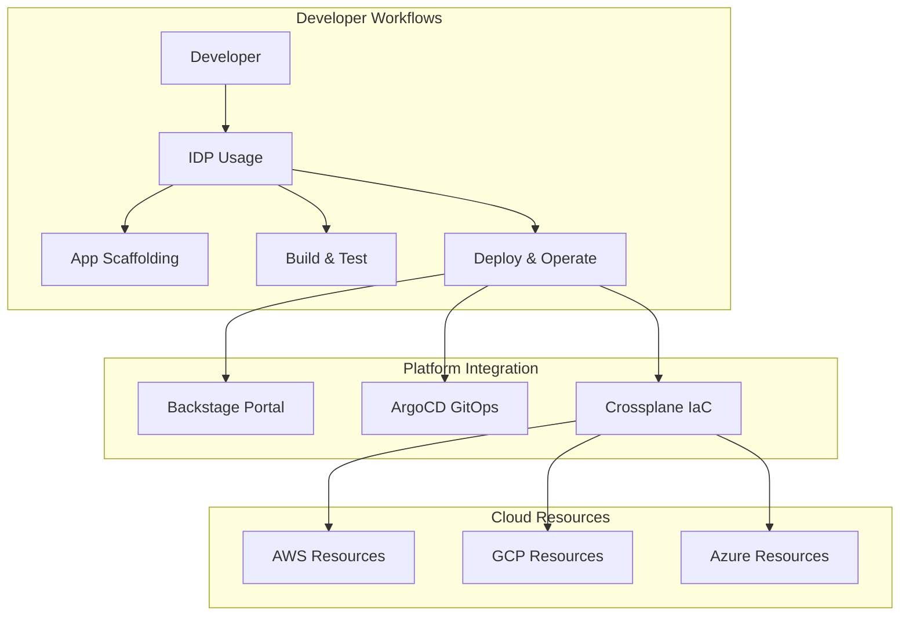

# IDP Usage - Developer Platform Guide

Welcome to **IDP Usage** - the developer-focused component of the IDP Stack that provides comprehensive workflows and tooling for application development, deployment, and operations on your Internal Developer Platform.

## Overview

IDP Usage transforms the platform infrastructure provided by IDP Builder into a powerful, self-service developer experience. It provides streamlined workflows for:

- **Application Development**: Scaffolding, coding, testing, and building applications
- **GitOps Deployment**: Automated deployment pipelines with GitOps practices
- **Multi-Environment Management**: Development, staging, and production workflows
- **Developer Onboarding**: Automated team and project setup
- **CI/CD Integration**: Comprehensive continuous integration and deployment

## Quick Start

### Prerequisites
- **IDP Builder**: Complete platform setup using `idp-builder`
- **Git Access**: Configured access to your Git repositories
- **Docker**: For local development and testing

### Basic Setup
```bash
cd idp-usage

# Check prerequisites
task prerequisites:check-development

# Onboard to the platform
task workflows:onboard-developer \
  DEVELOPER_NAME="your-name" \
  TEAM="your-team" \
  EMAIL="your-email@company.com"

# Create your first application
task workflows:demo-basic \
  APP_NAME="my-first-app" \
  LANGUAGE="python" \
  FRAMEWORK="fastapi"
```

### Your First Application
```bash
# Full application lifecycle demo
task workflows:demo-complete \
  APP_NAME="sample-microservice" \
  ENVIRONMENT="development"

# View your application in Backstage
task application:access-catalog
```

## Core Features

### 🚀 **Developer Workflows**
- **Rapid Scaffolding**: Generate applications from templates
- **Local Development**: Streamlined local development environment
- **Testing Integration**: Automated testing workflows
- **Code Quality**: Linting, formatting, and security scanning

### 🔄 **GitOps Integration** 
- **Automated Deployments**: Git-based deployment triggers
- **Environment Promotion**: Structured promotion workflows
- **Rollback Procedures**: Safe and quick rollback capabilities
- **Configuration Management**: Environment-specific configurations

### 🏗️ **Multi-Cloud Support**
- **Cloud Agnostic**: Deploy to AWS, GCP, Azure, or on-premises
- **Infrastructure as Code**: Crossplane-based resource management
- **Service Mesh**: Istio integration for advanced networking
- **Observability**: Built-in monitoring and logging

### 👥 **Team Collaboration**
- **Service Catalog**: Centralized service discovery
- **API Documentation**: Automated API documentation generation
- **Team Dashboards**: Real-time visibility into team services
- **Ownership Model**: Clear service ownership and responsibilities

## Task Categories

IDP Usage provides **48 comprehensive workflow tasks** organized into logical categories:

### Application Development (12 tasks)
```bash
# Application lifecycle
task application:scaffold-app            # Create new application from template
task application:build-local            # Build application locally
task application:test-unit              # Run unit tests
task application:test-integration       # Run integration tests
task application:package-container      # Build container image
task application:scan-security          # Security vulnerability scanning
task application:lint-code              # Code quality checks
task application:generate-docs          # Generate API documentation
task application:setup-database         # Configure application database
task application:configure-secrets      # Setup application secrets
task application:access-logs           # View application logs
task application:access-catalog        # Access service catalog
```

### Deployment and Operations (12 tasks)
```bash
# Deployment workflows  
task deploy:to-development              # Deploy to development environment
task deploy:to-staging                 # Deploy to staging environment
task deploy:to-production              # Deploy to production environment
task deploy:promote-environment        # Promote between environments
task deploy:rollback-deployment        # Rollback deployment
task deploy:update-config              # Update application configuration
task deploy:scale-application          # Scale application replicas
task deploy:health-check               # Application health verification
task deploy:performance-test           # Run performance tests
task deploy:canary-deployment          # Canary deployment strategy
task deploy:blue-green-deployment      # Blue-green deployment strategy
task deploy:disaster-recovery          # Disaster recovery procedures
```

### Team and Platform Workflows (12 tasks)
```bash
# Team management
task team:onboard-developer            # Onboard new team member
task team:create-project               # Create new team project
task team:setup-repository            # Setup Git repository
task team:configure-permissions       # Configure team permissions
task team:generate-certificates       # Generate service certificates
task team:setup-monitoring            # Configure monitoring
task team:backup-data                 # Backup team data
task team:offboard-developer          # Offboard team member
task team:rotate-secrets              # Rotate team secrets
task team:compliance-check            # Run compliance checks
task team:cost-analysis               # Analyze infrastructure costs
task team:performance-review          # Performance metrics review
```

### Comprehensive Demo Workflows (12 tasks)
```bash
# Demonstration and learning
task workflows:onboard-developer       # Complete developer onboarding
task workflows:demo-basic              # Basic application demo
task workflows:demo-complete           # Complete application lifecycle
task workflows:demo-microservices      # Microservices architecture demo
task workflows:demo-database           # Database integration demo
task workflows:demo-cicd               # CI/CD pipeline demo
task workflows:demo-monitoring         # Observability demo
task workflows:demo-security           # Security features demo
task workflows:demo-multi-cloud        # Multi-cloud deployment demo
task workflows:production-readiness    # Production readiness checklist
task workflows:advanced-patterns       # Advanced architecture patterns
task workflows:platform-showcase       # Complete platform showcase
```

## Architecture Integration

IDP Usage seamlessly integrates with IDP Builder's platform components:



## Getting Started Guides

### For Developers
1. **[Developer Onboarding](developer-onboarding.md)** - Complete onboarding guide
2. **[Application Development](application-development.md)** - Building your first app
3. **[Deployment Guide](deployment.md)** - Deploying applications
4. **[Best Practices](best-practices.md)** - Development best practices

### For Platform Teams
1. **[Team Setup](team-setup.md)** - Configuring teams and permissions
2. **[Workflow Customization](workflow-customization.md)** - Customizing workflows
3. **[Integration Guide](integration.md)** - Third-party integrations
4. **[Operations Guide](operations.md)** - Day-2 operations

## Demo Scenarios

### Basic Application Lifecycle
```bash
# Complete basic demo
task workflows:demo-basic \
  APP_NAME="hello-world-api" \
  LANGUAGE="python" \
  FRAMEWORK="fastapi"

# Access your application
open http://hello-world-api.platform.local
```

### Microservices Architecture
```bash
# Demonstrate microservices patterns
task workflows:demo-microservices \
  PROJECT_NAME="ecommerce-platform" \
  SERVICES="user-service,product-service,order-service"

# View service mesh in action
task application:access-catalog
```

### Production Deployment
```bash
# Production-ready deployment
task workflows:production-readiness \
  APP_NAME="critical-service" \
  ENVIRONMENT="production" \
  SLA_TIER="gold"

# Monitor deployment
task deploy:health-check APP_NAME="critical-service"
```

## Multi-Cloud Capabilities

### Cloud Provider Support
- **AWS**: EKS, RDS, S3, Lambda integration
- **Google Cloud**: GKE, Cloud SQL, Cloud Storage, Cloud Functions
- **Azure**: AKS, Azure Database, Blob Storage, Functions
- **On-Premises**: Kubernetes clusters, databases, storage

### Deployment Strategies
```bash
# Deploy to specific cloud provider
task deploy:to-production \
  APP_NAME="multi-cloud-app" \
  PROVIDER="aws" \
  REGION="us-east-1"

# Multi-region deployment
task workflows:demo-multi-cloud \
  APP_NAME="global-service" \
  REGIONS="us-east-1,eu-west-1,ap-southeast-1"
```

## Integration Ecosystem

### CI/CD Integration
- **GitHub Actions**: Automated workflows
- **GitLab CI**: Pipeline integration  
- **Jenkins**: Classic CI/CD integration
- **Tekton**: Kubernetes-native pipelines

### Monitoring and Observability
- **Prometheus**: Metrics collection
- **Grafana**: Visualization dashboards
- **Jaeger**: Distributed tracing
- **Fluentd**: Log aggregation

### Security Integration
- **Vault**: Secrets management
- **Falco**: Runtime security
- **OPA**: Policy enforcement
- **Cert-Manager**: Certificate management

## Support and Resources

### Documentation
- **[Installation Guide](installation.md)** - Complete setup instructions
- **[API Reference](api-reference.md)** - All tasks and parameters
- **[Troubleshooting](troubleshooting.md)** - Common issues and solutions
- **[FAQ](faq.md)** - Frequently asked questions

### Community
- **GitHub**: [Issues](https://github.com/vek0ng/idp-stack/issues) and [Discussions](https://github.com/vek0ng/idp-stack/discussions)
- **Documentation**: Comprehensive guides and examples
- **Examples**: Real-world usage patterns and templates

### Professional Services
- **Training**: Platform adoption training
- **Consulting**: Custom implementation services
- **Support**: Enterprise-grade support options

## Next Steps

1. **Complete the Quick Start**: Get your first application running
2. **Explore Workflows**: Try different demo scenarios
3. **Customize Templates**: Create your own application templates
4. **Integrate Tools**: Connect your existing development tools
5. **Scale Teams**: Onboard additional developers and teams

IDP Usage transforms complex platform capabilities into simple, powerful workflows that accelerate development velocity while maintaining operational excellence.

---

**Ready to transform your development experience?** Start with the [Quick Start](#quick-start) guide and discover how IDP Usage can accelerate your team's productivity.
